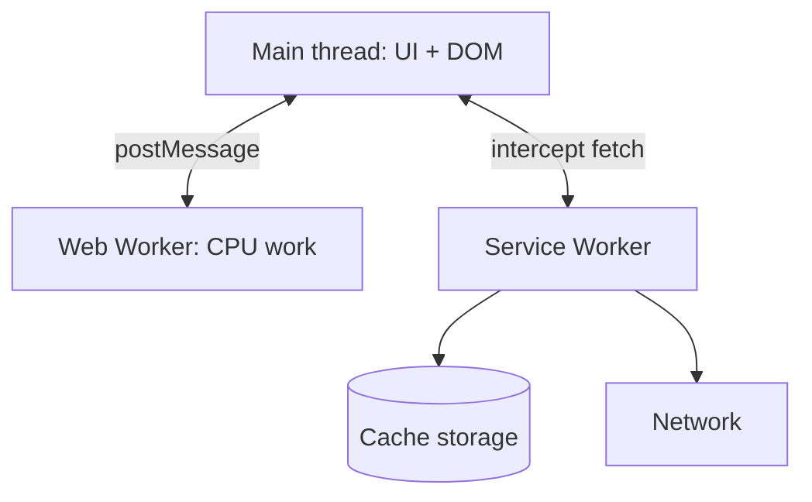

# Web Workers and Service Workers

## Concept

- Browser JavaScript runs on a **single main thread** shared with rendering, so heavy JS blocks the UI (jank, unresponsive input). **Workers** are background threads that run JS off the main thread.
- **Web Workers** — general-purpose background threads for **CPU-intensive work** (parsing, image/data processing, crypto, heavy computation). They have no DOM access and communicate with the main thread via message passing (`postMessage`), so the UI stays responsive while they compute.
- **Service Workers** — a special worker that acts as a **programmable network proxy** between the app and the network. It intercepts requests, enabling **offline support, caching strategies, background sync, and push notifications**. It's the engine behind Progressive Web Apps (topic 19).
- A related newer primitive: **Web Workers + SharedArrayBuffer** for shared-memory parallelism, and **Worklets** for low-level audio/animation.

## Problem It Solves

- **Web Workers** keep the UI smooth by moving expensive computation off the main thread — input stays responsive and animations don't jank during heavy work.
- **Service Workers** enable **offline-first** experiences (serve from cache when the network is down), faster repeat loads (cache-first assets), resilience to flaky networks, push notifications, and background sync — capabilities native apps had that the web lacked.

## Trade-offs

- **Web Workers: parallelism vs. communication cost** — they isolate CPU work but communicate via message passing, which **copies** data (structured clone) unless you use transferable objects/SharedArrayBuffer; chatty or large data transfer can erode the benefit. No DOM access, so they're for computation, not UI.
- **Service Workers: power vs. complexity & footguns** — caching strategies are powerful but easy to get wrong (serving stale assets indefinitely, broken updates). They have a lifecycle (install/activate/update) that's subtle; a bad SW can "trap" users on an old version. Cache-busting and update flows must be handled carefully.
- **HTTPS required** — Service Workers only run over HTTPS (security), and they add a layer that complicates debugging ("why am I seeing old content?").
- **Not for everything** — overusing workers for trivial work adds overhead; reserve Web Workers for genuinely heavy tasks.

## Examples

- **Web Worker for heavy compute**
  - Parsing a large CSV, processing image pixels, or running a client-side search index in a worker so the UI doesn't freeze; results posted back to the main thread.
- **Service Worker caching strategies**
  - *Cache-first* for fingerprinted static assets (instant repeat loads), *network-first* for API data (fresh with offline fallback), *stale-while-revalidate* for a fast-then-fresh balance.
- **Offline app**
  - A PWA caches the app shell in a Service Worker so it loads and functions offline, syncing queued actions when connectivity returns (background sync).
- **Update flow**
  - A new Service Worker installs in the background and activates on next load (or prompts "new version available, reload"), avoiding trapping users on stale code.
- **Interview framing**
  - Use Web Workers when heavy client computation would jank the UI; use Service Workers for offline support, asset caching strategies, and push. Calling out the message-passing copy cost (Web Workers) and the stale-cache/update-lifecycle footguns (Service Workers) shows real hands-on experience.
