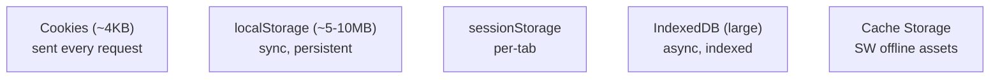

# Browser Storage

## Concept

- The browser offers several client-side storage mechanisms, each with different capacity, persistence, API, and use cases. Choosing the right one is a common design decision.
  - **Cookies** — small (~4KB), sent with **every HTTP request** to the matching domain. Designed for server-readable state (session IDs, auth tokens). Have flags: `HttpOnly` (JS can't read — XSS protection), `Secure`, `SameSite` (CSRF protection).
  - **localStorage** — ~5–10MB, **synchronous** key→string API, **persists** until cleared. Same-origin, JS-accessible. For non-sensitive, small, persistent data (theme, flags).
  - **sessionStorage** — like localStorage but **scoped to the tab** and cleared when the tab closes.
  - **IndexedDB** — a large (hundreds of MB+), **asynchronous**, transactional, indexed NoSQL database in the browser. For substantial structured/offline data.
  - **Cache Storage** — used by Service Workers (topic 12) to cache request/response pairs for offline.

## Problem It Solves

- Lets web apps **persist state on the client** — auth sessions, user preferences, drafts, offline data — without a server round trip for every read.
- Each mechanism fits a need: cookies for server-shared auth, localStorage for small persistent UI state, IndexedDB for large offline datasets, Cache Storage for offline assets.
- Enables offline-first and fast, responsive UIs that don't refetch everything.

## Trade-offs

- **Security is the dominant concern** — `localStorage`/`sessionStorage` are **readable by any JS on the page**, so an XSS vulnerability exposes anything stored there. **Never store sensitive tokens (JWTs, secrets) in localStorage.** Prefer `HttpOnly` cookies for auth tokens so JS (and XSS) can't read them (Phase 2, topic 14).
- **Cookies cost bandwidth** — sent on every request to the domain, so large/many cookies slow every request; keep them minimal.
- **Sync vs. async** — localStorage is synchronous and blocks the main thread for large reads/writes; IndexedDB is async and suited to large data but has a clunkier API (wrappers like Dexie help).
- **Capacity & eviction** — storage has quotas and can be evicted by the browser under pressure; don't treat client storage as guaranteed-durable.
- **CSRF vs. XSS** — cookies are vulnerable to CSRF (mitigated by `SameSite`/CSRF tokens); localStorage avoids CSRF but is exposed to XSS. There's no single "safe" option — match the threat model (Phase 2, topic 14; frontend security, topic 16).

## Examples

- **Auth token storage**
  - Store the session/refresh token in an `HttpOnly; Secure; SameSite=Strict` cookie so JS/XSS can't exfiltrate it; keep a short-lived access token in memory — not in localStorage.
- **User preferences**
  - Theme, language, sidebar-collapsed state in `localStorage` — non-sensitive, small, persistent.
- **Offline data**
  - A note-taking app stores drafts and synced documents in IndexedDB so it works offline and syncs later.
- **Per-tab state**
  - A multi-step wizard's progress in `sessionStorage` so each tab is independent and it clears when the tab closes.
- **Interview framing**
  - When auth/state persistence comes up, map data to the right store and lead with security: `HttpOnly` cookies for tokens (XSS-safe), localStorage only for non-sensitive small state, IndexedDB for large offline data. The "never put JWTs in localStorage" point is a frequent and important interview signal.
