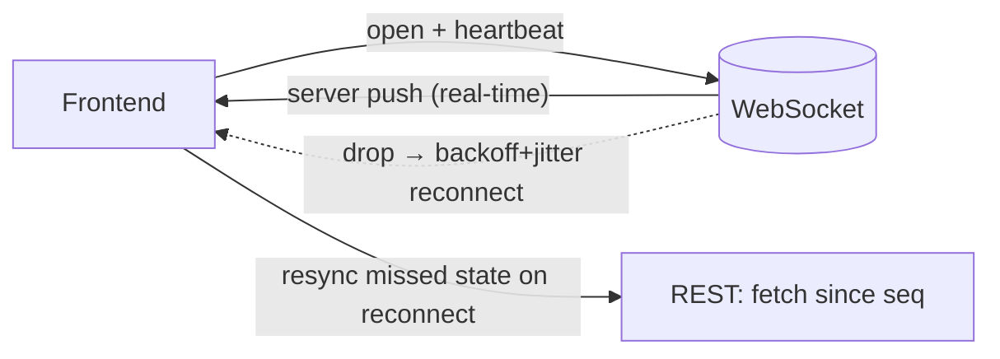

# WebSockets on the Frontend

## Concept

- **WebSockets** provide a persistent, **full-duplex** (bidirectional) connection between browser and server over a single long-lived TCP connection - enabling real-time, low-latency push *from* the server without the client polling. (Protocol fundamentals are in Phase 2, topic 8; this topic is the *client-side* engineering.)
- The frontend concerns are about managing a **stateful, long-lived connection** reliably in an environment (the browser) where networks drop, tabs sleep, and users move between Wi-Fi and cellular:
  - **Connection lifecycle**: open, message, error, close handlers; tracking connection state in the UI.
  - **Reconnection**: automatic reconnect with **exponential backoff + jitter** when the connection drops (and avoiding reconnect storms - Phase 4, topic 31).
  - **Heartbeats / ping-pong**: detect dead connections that TCP hasn't noticed yet.
  - **Message handling**: serialization, queuing messages while disconnected, and **resyncing missed state** on reconnect (sequence numbers / fetch-since).
  - **Backpressure & rendering**: high-frequency messages can overwhelm the UI; batch/throttle updates.

## Problem It Solves

- Powers real-time UX - chat, live presence, collaborative editing, live dashboards, notifications, multiplayer - with instant server-to-client push instead of polling.
- The client-side patterns make that real-time experience **robust**: connections recover automatically, missed messages are resynced, and the UI reflects connection state honestly.

## Trade-offs

- **Real-time power vs. connection management burden**: a persistent connection is far more complex to manage on the client than stateless HTTP: you own reconnection, heartbeats, state resync, and auth refresh over a long-lived socket.
- **Missed-message problem**: while disconnected, the client misses pushes; on reconnect it must reconcile (request everything since the last sequence number, or refetch state) - otherwise the UI silently goes stale.
- **Scaling & fallback**: WebSockets need sticky/stateful server handling; some networks/proxies block them, so apps sometimes fall back to SSE (topic 15) or long-polling. Libraries (Socket.IO) add fallbacks at a cost.
- **Battery/perf**: keeping a socket open and processing frequent messages drains battery and can flood the main thread; throttle rendering and consider closing sockets on hidden tabs.
- **When not to use**: for server→client-only updates (notifications, feeds), **SSE** is simpler; WebSockets shine when you need true bidirectional, low-latency messaging.

## Examples

- **Resilient client wrapper**
  - A WebSocket wrapper that auto-reconnects with exponential backoff + jitter, sends periodic heartbeats, buffers outgoing messages while down, and on reconnect calls `GET /messages?since=<lastSeq>` to fill gaps.
- **Presence + state**
  - A collaborative app shows "connecting/online/offline" from the socket state and re-syncs the document via a snapshot fetch on reconnect (pairing real-time with a REST source of truth).
- **Throttled rendering**
  - A live trading dashboard receives hundreds of ticks/sec but updates the UI at most every animation frame (`requestAnimationFrame`), batching messages to avoid jank.
- **Interview framing**
  - For real-time frontend features, go beyond "use WebSockets": describe reconnection with backoff+jitter, heartbeats, **missed-message resync via sequence numbers**, UI connection-state, and SSE/long-polling fallback. The resync-on-reconnect detail is what separates a production answer from a demo.
