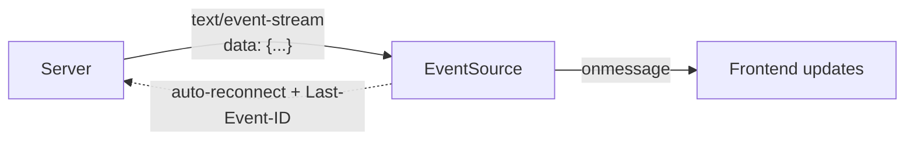

# SSE on the Frontend

## Concept

- **Server-Sent Events (SSE)** provide a **one-way, server-to-client** stream over a single long-lived HTTP connection. The browser's built-in `EventSource` API receives a continuous stream of text events the server pushes — ideal when you only need updates *flowing down* to the client.
- Unlike WebSockets (bidirectional, separate protocol), SSE is plain HTTP, so it works with existing HTTP infrastructure (proxies, HTTP/2, auth, compression) and is much simpler on the client.
- Built-in conveniences the browser handles for you:
  - **Automatic reconnection** — `EventSource` reconnects on drop without custom code.
  - **`Last-Event-ID`** — the browser resends the last event ID on reconnect, so the server can **replay missed events** — solving the missed-message problem with almost no client work.
  - **Named events** and a simple text wire format.

## Problem It Solves

- Delivers real-time **server push** (notifications, live feeds, progress updates, streaming LLM tokens, dashboards) with far less complexity than WebSockets when the client doesn't need to send a continuous stream back.
- **Auto-reconnect + Last-Event-ID** give robust, gap-free streaming almost for free — the resilience you'd hand-build for WebSockets is built into the browser.
- Works over standard HTTP, so it plays nicely with CDNs, HTTP/2 multiplexing, and existing auth.

## Trade-offs

- **One-way only** — the client can't push over the same channel; for bidirectional needs (chat, collaboration), use WebSockets (topic 14). Client→server still uses normal HTTP requests.
- **HTTP/1.1 connection limit** — browsers cap ~6 concurrent HTTP/1.1 connections per origin, and each SSE stream holds one open; many simultaneous streams can exhaust the limit. **HTTP/2+ multiplexing** removes this (many streams over one connection) — a reason to serve SSE over HTTP/2.
- **Text only** — SSE carries UTF-8 text (typically JSON); binary needs encoding (base64) or WebSockets.
- **Proxy buffering** — some proxies buffer responses, delaying events; needs correct headers (`Cache-Control: no-cache`, disable buffering).
- **Server resource** — like any long-lived connection, many concurrent SSE streams consume server connections/memory; needs capacity planning.

## Examples

- **Streaming LLM responses**
  - An AI chat UI consumes tokens via SSE (`data:` chunks) and appends them as they arrive — the dominant pattern for streaming model output to the browser.
- **Live notifications/feed**
  - `new EventSource('/stream')` with `onmessage` updating a notifications badge or activity feed in real time, auto-reconnecting if the network blips.
- **Progress updates**
  - A long server job streams progress events (`event: progress\ndata: 42%`) to update a progress bar without polling.
- **Gap-free reconnect**
  - On reconnect, the browser sends `Last-Event-ID: 1057`; the server replays events after 1057, so the feed has no gaps — no client code required.
- **Interview framing**
  - Choose SSE for **server→client-only** real-time (feeds, notifications, streaming tokens, progress) and highlight its built-in auto-reconnect + Last-Event-ID replay and HTTP friendliness; reserve WebSockets for bidirectional needs. Recommending SSE-over-HTTP/2 to dodge the connection limit is a sharp detail.
