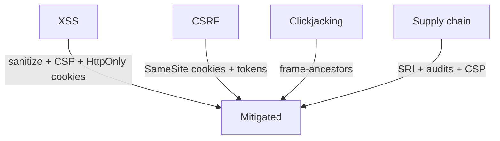

# Frontend Security

## Concept

- **Frontend security** covers the browser-side attack surface - the vulnerabilities that live in the client and the defenses that mitigate them. The frontend is a primary target because it runs untrusted-network code in the user's session.
- The major threats and defenses:
  - **XSS (Cross-Site Scripting)**: attacker-injected JS runs in your page with your user's privileges. Defenses: **escape/sanitize all untrusted output**, avoid `innerHTML`/`dangerouslySetInnerHTML`, use a **Content Security Policy (CSP)**, and store auth tokens in `HttpOnly` cookies so stolen-JS can't read them.
  - **CSRF (Cross-Site Request Forgery)**: a malicious site makes the browser send authenticated requests using the user's cookies. Defenses: **`SameSite` cookies**, CSRF tokens, checking Origin/Referer.
  - **Clickjacking**: your site framed invisibly to trick clicks. Defense: `X-Frame-Options` / CSP `frame-ancestors`.
  - **Supply-chain / third-party scripts**: a compromised npm package or CDN script runs in your page. Defenses: **Subresource Integrity (SRI)**, dependency auditing, CSP.
  - **Sensitive data exposure**: secrets in client code/storage. Never ship secrets to the client; mind storage (topic 13).

## Problem It Solves

- Protects users from having their session hijacked, actions forged, clicks stolen, or data exfiltrated through the browser.
- Establishes defense-in-depth so a single bug (e.g., one unsanitized string) doesn't immediately become full account takeover.
- Frontends handle auth tokens and user data, so getting this wrong is directly a breach.

## Trade-offs

- **CSP strictness vs. effort**: a strict CSP (no inline scripts, allowlisted sources, nonces) is one of the strongest XSS mitigations but is laborious to adopt in existing apps (inline scripts/styles break) and needs ongoing maintenance.
- **Cookies vs. localStorage for tokens**: `HttpOnly` cookies protect tokens from XSS but are exposed to CSRF (mitigated by `SameSite`); localStorage avoids CSRF but is fully exposed to XSS. No option is free of trade-offs - choose per threat model (topic 13; Phase 2, topic 14).
- **Third-party scripts vs. control**: analytics/ads/widgets add capability but each is code running in your page with access to the DOM and (without precautions) your users; SRI and CSP reduce but don't eliminate the risk.
- **Sanitization vs. functionality**: rich user content (HTML, markdown) must be sanitized (DOMPurify) without breaking legitimate formatting - a careful allowlist, not a blocklist.

## Examples

- **Stored XSS prevention**
  - User comments rendered with framework auto-escaping (React escapes by default); when raw HTML is required, sanitize with DOMPurify and never pass unsanitized strings to `dangerouslySetInnerHTML`.
- **CSP header**
  - `Content-Security-Policy: default-src 'self'; script-src 'self' 'nonce-abc123'` blocks injected inline scripts and disallows arbitrary external sources - neutralizing most reflected/stored XSS payloads.
- **SameSite + CSRF token**
  - Auth cookie set `SameSite=Lax; Secure; HttpOnly`; state-changing POSTs also require a CSRF token, blocking cross-site forged requests.
- **SRI on CDN scripts**
  - `<script src="https://cdn/lib.js" integrity="sha384-..." crossorigin>` ensures a tampered CDN file won't execute.
- **Interview framing**
  - For frontend security, enumerate the threat→defense pairs: XSS → escaping + CSP + HttpOnly cookies; CSRF → SameSite + tokens; clickjacking → frame-ancestors; supply chain → SRI + audits. Discussing the cookie-vs-localStorage XSS/CSRF trade-off and a strict CSP marks a security-aware engineer.
