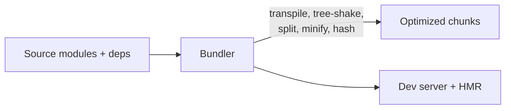

# Bundlers and Build Tools

## Concept

- **Bundlers** take a project's many source modules (JS/TS, CSS, images) and their dependency graph and produce optimized **bundles** the browser can load efficiently. **Build tools** wrap bundling with transpilation, optimization, and a dev server.
- What they do:
  - **Module bundling** — resolve `import`/`require` into a dependency graph and combine modules.
  - **Transpilation** — modern/TS/JSX → browser-compatible JS (Babel, SWC, esbuild).
  - **Tree shaking** — eliminate unused exports (dead-code elimination) to shrink bundles.
  - **Minification** — strip whitespace, shorten names, drop dead code.
  - **Code splitting** (topic 8), **asset handling** (hashing for cache-busting), **CSS processing**.
  - **Dev server with HMR (Hot Module Replacement)** — instant feedback without full reloads.
- The landscape: **Webpack** (mature, configurable, slower), **Vite** (dev uses native ES modules + esbuild for instant startup; prod uses Rollup), **esbuild**/**SWC** (Go/Rust, extremely fast), **Turbopack/Rspack** (next-gen).

## Problem It Solves

- **Ships less, faster code** — tree shaking, minification, and splitting reduce bytes; hashing enables long-term caching; the result loads faster (better Core Web Vitals).
- **Developer experience** — lets you write modern modular TS/JSX with npm packages and get instant feedback (HMR) while producing browser-ready output.
- Manages the complexity of turning a large modular codebase into efficient deliverables.

## Trade-offs

- **Configurability vs. speed/simplicity** — Webpack is endlessly configurable but slow and complex; Vite/esbuild prioritize speed and zero-config DX but are sometimes less flexible for exotic setups. Most new projects pick Vite.
- **Dev vs. prod parity** — Vite serves unbundled ES modules in dev (fast) but bundles with Rollup in prod, so dev and prod behavior can subtly differ; test the production build.
- **Bundle size vigilance** — bundlers make it easy to `import` heavy libraries; without bundle analysis, size creeps up. Use bundle analyzers and prefer tree-shakeable, lightweight deps.
- **Build performance vs. tooling churn** — Rust/Go tools (SWC, esbuild, Turbopack) are dramatically faster but the ecosystem moves fast and some plugins lag.
- **Transpilation targets** — targeting older browsers adds polyfills/larger output; set a sensible browserslist to avoid shipping legacy code to modern users.

## Examples

- **Vite project**
  - Instant dev server via native ESM + esbuild transpilation; production build via Rollup with tree shaking, code splitting, and hashed assets.
- **Tree shaking**
  - Importing `{ debounce } from 'lodash-es'` (ESM) lets the bundler drop the rest of lodash; importing the CommonJS `lodash` default can pull in everything.
- **Bundle analysis**
  - A bundle analyzer reveals a 300KB date library; replacing it with a 6KB alternative (or native `Intl`) shrinks the bundle.
- **Cache-busting**
  - Output `app.4f3a1b.js` with a content hash; the filename changes only when content changes, so users cache aggressively and re-download only what changed.
- **Interview framing**
  - When build/performance comes up, explain bundling's role (tree shaking, minification, splitting, hashing for caching) and the modern shift to fast tools (Vite/esbuild/SWC). Mentioning bundle analysis and tree-shakeable imports as the levers for controlling JS payload shows practical depth.
