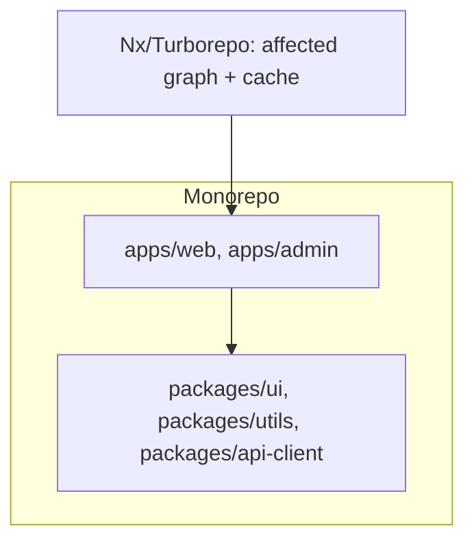

# Monorepo Architecture

## Concept

- A **monorepo** is a single version-controlled repository holding **multiple projects/packages** (apps, shared libraries, design system, tooling) that are developed, versioned, and often released together - as opposed to a **polyrepo** (one repo per project).
- It's an organizational/tooling pattern especially common in frontend (and full-stack) ecosystems where a web app, a mobile app, a component library, and shared utilities evolve together.
- Modern monorepos rely on tooling for speed at scale:
  - **Workspaces** (npm/yarn/pnpm) - manage interdependent packages with shared dependency installation.
  - **Build orchestration & caching** (Nx, Turborepo, Bazel) - only rebuild/test what changed, with local and **remote build caches** so CI doesn't redo unchanged work.
  - **Affected/graph analysis**: determine which projects a change impacts to run only relevant tasks.

## Problem It Solves

- **Code sharing & consistency**: shared libraries (design system, types, utils) are used directly without publishing/versioning npm packages between repos; one change updates all consumers atomically.
- **Atomic cross-project changes**: a change to a shared component and all the apps that use it lands in **one commit/PR**, avoiding the version-bump dance of polyrepos.
- **Unified tooling**: one lint/test/build config, one CI setup, consistent standards across all projects.
- **Single source of truth**: everyone sees the whole system; refactors that span app + library are straightforward.

## Trade-offs

- **Atomic changes vs. coupling & blast radius**: easy cross-project changes also mean a change can break many projects at once; needs strong CI and the affected-graph tooling to catch it.
- **Scale challenges**: large monorepos get slow (install, build, test, git operations) without serious tooling (caching, affected analysis, sparse checkouts); naive monorepos don't scale.
- **Tooling investment**: Nx/Turborepo/Bazel add power but also setup and learning cost; small projects may not need them.
- **Access control & ownership**: one repo makes fine-grained permissions and clear ownership harder (mitigated by CODEOWNERS and module boundaries).
- **Monorepo vs. polyrepo**: polyrepo gives independent versioning/deploys and isolation but suffers cross-repo coordination pain and version drift; the choice depends on how tightly projects are coupled and team structure (Conway's Law).

## Examples

- **Shared design system**
  - `packages/ui` is consumed by `apps/web` and `apps/admin`; updating a button and both apps happens in one PR, with CI testing both via affected analysis.
- **Turborepo caching**
  - CI builds only projects affected by a change and restores unchanged build outputs from a remote cache, cutting pipeline time dramatically.
- **Type sharing**
  - Shared TypeScript types in `packages/types` keep frontend and backend (in the same monorepo) in sync, catching API contract mismatches at compile time.
- **When polyrepo fits**
  - Independent teams shipping unrelated services on separate cadences may prefer polyrepo for isolation and independent deploys.
- **Interview framing**
  - Discuss monorepos when the question involves multiple apps/shared libraries or platform-team structure: highlight atomic cross-project changes and code sharing, the need for affected-graph + caching tooling (Nx/Turborepo) to scale, and the trade-off against polyrepo's independence. Tying the choice to team topology shows architectural maturity.
