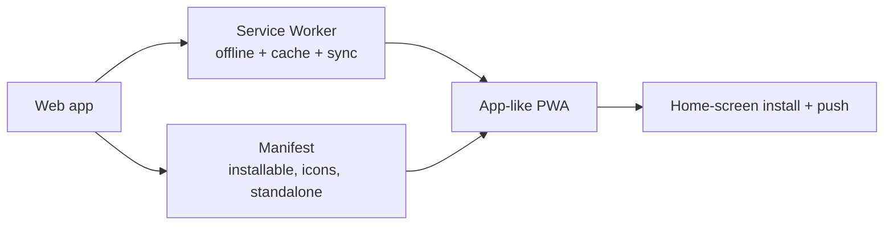

# Progressive Web Apps (PWA)

## Concept

- A **Progressive Web App** is a web app that uses modern browser capabilities to deliver an **app-like experience** — installable, offline-capable, with push notifications — while remaining a website (no app store required).
- The core ingredients:
  - **Service Worker** (topic 12) — the engine: intercepts network requests for **offline support** and caching, enables **background sync** and **push notifications**.
  - **Web App Manifest** — a JSON file declaring the app's name, icons, theme, and display mode, making the app **installable** to the home screen and launchable standalone (no browser chrome).
  - **HTTPS** — required for Service Workers and install.
  - **Responsive, app-like UX** — works across form factors, feels native.
- "Progressive" means it **enhances gracefully**: it works as a normal site everywhere and layers on app features where supported.

## Problem It Solves

- Brings native-app capabilities — **offline use, home-screen install, push notifications, background sync** — to the web without app-store friction, downloads, or platform-specific codebases.
- **Reach + reliability** — one codebase reaches all platforms via the web, works on flaky/no networks (offline-first), and loads instantly on repeat visits (cached shell).
- Lower friction than native: no install gate, instant updates, linkable/shareable.

## Trade-offs

- **Capability gap vs. native** — PWAs still can't match native for deep OS integration (some hardware APIs, background execution limits), and **iOS historically restricts PWA features** (limited push history, storage eviction, no real install prompts) — cross-platform parity isn't guaranteed.
- **Service Worker complexity** — offline caching is powerful but a common source of "stale app" bugs and tricky update flows (topic 12); caching strategy must be deliberate.
- **Discoverability** — PWAs aren't (traditionally) in app stores, so they miss that distribution/discovery channel (though some stores now accept them).
- **Storage limits/eviction** — offline data quotas vary and the browser can evict storage under pressure; not a guarantee of durability.
- **Not always needed** — many sites don't need offline/install; adding a Service Worker for no reason adds risk and maintenance.

## Examples

- **Offline-first app shell**
  - The Service Worker caches the HTML/CSS/JS app shell (cache-first) so the app loads instantly and works offline; data uses network-first with an offline fallback and IndexedDB (topic 13).
- **Installable experience**
  - A manifest with icons and `display: standalone` lets users "Add to Home Screen"; the app launches full-screen like a native app.
- **Background sync**
  - Actions taken offline (e.g., sending a message) are queued and synced automatically when connectivity returns.
- **Push notifications**
  - Re-engagement via web push (where supported) without a native app.
- **Interview framing**
  - Propose a PWA when offline support, installability, or push add real value (field tools, messaging, content apps) — and be honest about limits (iOS restrictions, Service Worker staleness, storage eviction). Framing it as "native-like capability via Service Worker + manifest, progressively enhanced" is the right level.
