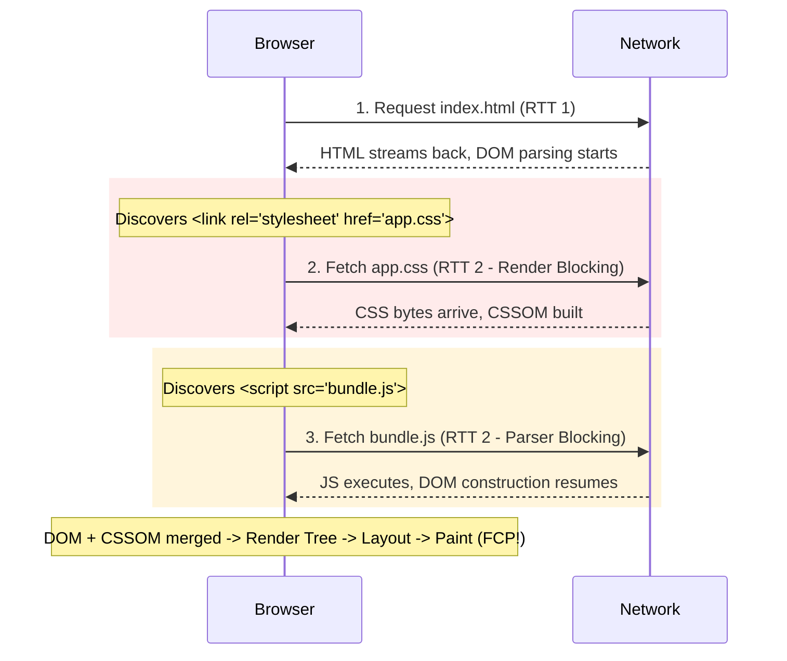

# Critical Rendering Path

## Concept

- The **Critical Rendering Path (CRP)** is the sequence of events and network transfers required for a browser to render the initial visual state of a webpage (First Contentful Paint / Largest Contentful Paint).
- Optimizing the CRP means minimizing the time between a user clicking a link and pixels appearing on screen by reducing:
  1. **Critical Resources**: The number of network requests that block the initial render.
  2. **Critical Bytes**: The total payload weight (HTML, CSS, JS) required to reach first paint.
  3. **Critical Path Length**: The number of sequential network round-trips (RTTs) required to fetch dependent critical resources.
- Resources interact with the CRP differently:
  - **HTML**: Render-blocking. The parser constructs the DOM as bytes stream over the network.
  - **CSS**: Render-blocking by default. The browser will not render any content until the CSSOM is constructed, preventing Flash of Unstyled Content (FOUC).
  - **JavaScript**: Parser-blocking by default. When the HTML parser encounters a synchronous `<script>` tag, it pauses DOM parsing, fetches the script, and executes it immediately (because scripts can inspect or alter the DOM and CSSOM).



## Problem It Solves

- Eliminates blank white screens on page navigation. Directly improves user retention, conversion rates, and Google Core Web Vitals rankings (specifically **First Contentful Paint (FCP)** and **Largest Contentful Paint (LCP)**).
- Prevents layout shifts and jarring visual flickers by giving developers precise control over loading prioritization.

## Trade-offs

- **Inlining Critical CSS vs. Cacheability**:
  - Inlining critical above-the-fold CSS directly inside `<style>` in the HTML document eliminates an entire network RTT. However, inlined CSS cannot be cached separately by CDNs or browsers, increasing the base HTML document size on subsequent page views.
- **`defer` vs. `async` Scripts**:
  - `async` downloads the script in parallel without blocking HTML parsing, but executes the moment download completes (which interrupts parsing and does not preserve script execution order).
  - `defer` downloads in parallel and executes only *after* DOM parsing is finished, in strict document order. `defer` is almost always preferred for application bundles, while `async` suits independent telemetry or third-party analytics.
- **Resource Hints Overhead**:
  - Aggressive `<link rel="preload">` or `preconnect` tags can starve critical HTML/CSS downloads if low-priority assets (like fonts or hero images) saturate the client's network bandwidth.

## Examples

- **Optimal Document Head for Minimal CRP**
  ```html
  <head>
    <!-- Preconnect to external asset origins to complete DNS/TLS handshakes early -->
    <link rel="preconnect" href="https://assets.example.com" crossorigin />
    <link rel="preconnect" href="https://fonts.gstatic.com" crossorigin />

    <!-- Inline critical above-the-fold styles: zero external CSS RTT for first paint -->
    <style>
      body { margin: 0; font-family: system-ui; }
      .hero { height: 100vh; display: flex; align-items: center; }
    </style>

    <!-- Asynchronously load non-critical CSS without blocking render -->
    <link rel="preload" href="/non-critical.css" as="style" onload="this.onload=null;this.rel='stylesheet'" />

    <!-- Preload Largest Contentful Paint (LCP) hero image -->
    <link rel="preload" href="/hero.webp" as="image" fetchpriority="high" />

    <!-- Defer all scripts so DOM parsing is uninterrupted -->
    <script src="/app.js" defer></script>
  </head>
  ```

- **Modern Module Scripts**
  - Using `<script type="module" src="main.js">` automatically applies `defer` semantics by default, executing after the DOM is constructed.

- **Interview Framing**
  - Anchor your answer on the 3 critical levers: **minimize critical resources, minimize critical bytes, and shorten path length (RTTs)**. Walk the interviewer through the loading timeline: stream the HTML document, inline critical above-the-fold CSS to achieve paint in 1 RTT, `defer` JS application bundles, and mark high-priority hero elements with `fetchpriority="high"`. Show awareness that CSS blocks rendering while JS blocks DOM parsing.
