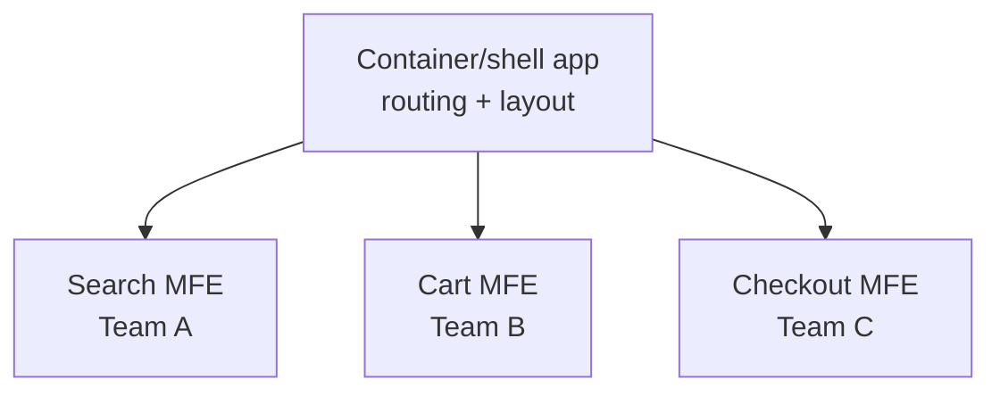

# Micro Frontends

## Concept

- **Micro frontends** apply the microservices idea to the frontend: a large web application is split into **independently developed, deployed, and owned** pieces, each owned by a different team, composed into one cohesive UI.
- Each micro frontend is a vertical slice (e.g., "search," "cart," "checkout") owned end-to-end by one team. The goal is **team autonomy and independent deployability** for the frontend, mirroring backend service boundaries.
- Composition/integration approaches:
  - **Build-time**: packages composed at build (simple, but couples deploys - less "micro").
  - **Run-time via Module Federation** (Webpack) - apps load each other's code at runtime; independent deploys.
  - **Iframe / Web Components**: strong isolation, looser coupling.
  - **Edge/server-side composition**: assemble fragments server-side.
- A **shell/container app** handles routing, shared layout, and orchestrating the micro frontends.

## Problem It Solves

- **Independent deployability & team autonomy**: teams ship their part of the UI on their own cadence without a coordinated monolithic frontend release, removing the shared-release bottleneck at scale.
- **Scaling organizations**: lets many teams work on one product's frontend without stepping on each other (Conway's Law applied to the UI).
- **Tech incrementalism**: allows gradual migration (e.g., strangler-fig a legacy app one section at a time) and, in principle, different frameworks per MFE.

## Trade-offs

- **Autonomy vs. heavy cost & complexity**: micro frontends add substantial complexity (composition, shared dependencies, routing, cross-MFE communication) and are **over-engineering for most apps**. They pay off only at genuine organizational scale (many teams on one large frontend).
- **Bundle bloat / duplication**: each MFE may ship its own copy of React etc.; without careful shared-dependency management, total payload balloons (hurting performance - the opposite of the user's interest).
- **Consistency**: keeping UX, design system, and versions consistent across independently-deployed MFEs is hard; a shared design system (topic 23) is essentially mandatory.
- **Runtime failures & integration**: one MFE breaking can affect the shell; cross-MFE communication and shared state are awkward and need clear contracts.
- **Performance tax**: extra orchestration, multiple bundles, and runtime loading can degrade load and interactivity if not managed (defeating frontend perf goals).

## Examples

- **Module Federation**
  - The shell app dynamically loads `search`, `cart`, and `checkout` remotes at runtime; each team deploys its remote independently, and the shell composes them, sharing a single React instance via federation config.
- **Strangler migration**
  - A legacy monolithic frontend is incrementally replaced by routing specific paths to new micro frontends until the old app is gone (Phase 11 evolutionary architecture).
- **Shared design system**
  - All MFEs consume the same versioned design-system package so the composed UI looks and behaves consistently.
- **When to avoid**
  - A single team building one app should use a modular monolith frontend (topic 6), not micro frontends - the overhead isn't justified.
- **Interview framing**
  - Recommend micro frontends only when **many teams** must independently own and deploy parts of one large frontend; otherwise call them over-engineering. If proposing them, address shared-dependency/bundle management, a mandatory design system, and the performance cost - showing you weigh the heavy trade-offs, not just the autonomy upside.
