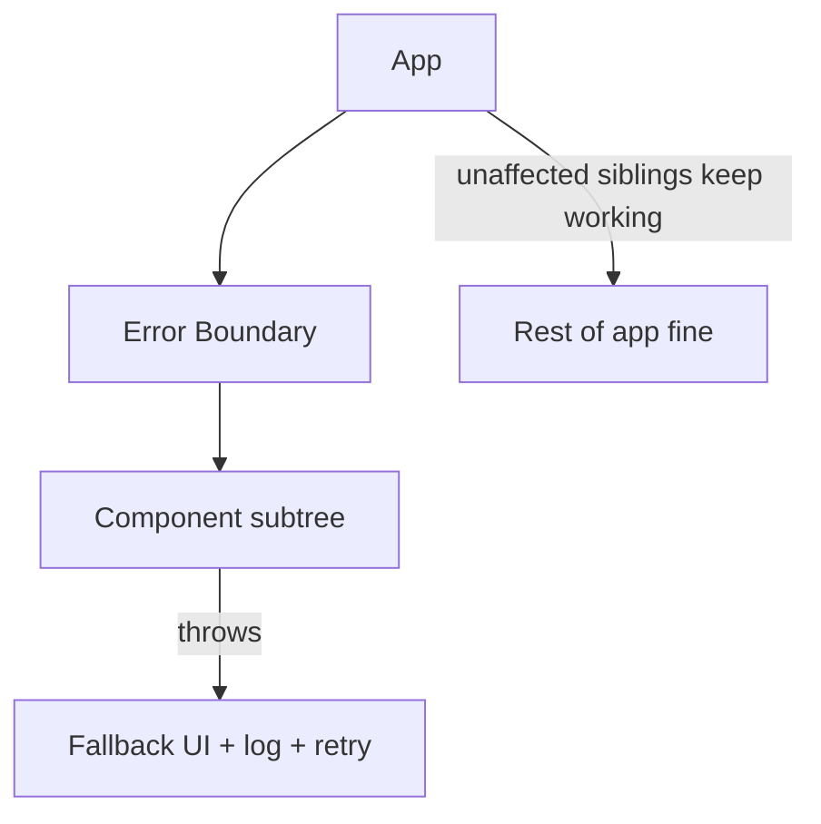

# Error Boundaries and Resilience

## Concept

- **Frontend resilience** is designing the UI to **degrade gracefully** when parts fail — a component crash, a failed API call, a slow network — instead of showing a blank white screen or a frozen app.
- **Error boundaries** (React) are components that **catch JavaScript errors in their child tree**, log them, and render a fallback UI instead of letting the whole app crash. They contain a failure to a subtree — the frontend analog of bulkheads (Phase 4, topic 29).
- Broader resilience patterns:
  - **Fallback UIs** — skeletons, "couldn't load this section, retry" panels.
  - **Retry with backoff** for failed requests; **timeouts** so slow calls don't hang the UI.
  - **Optimistic UI with rollback** — update immediately, revert if the server rejects.
  - **Offline/degraded modes** — show cached data and queue actions (topics 12, 19).
  - **Partial rendering** — render what succeeded; isolate what failed.

## Problem It Solves

- Prevents a single component error or failed request from taking down the **entire** UI (the dreaded blank white screen) — the failure is contained to one region while the rest stays usable.
- Maintains a usable, trustworthy experience under real-world conditions: flaky networks, partial backend outages, unexpected data, and bugs.
- Gives users a path forward (retry, cached content, a clear message) instead of a dead end, and gives engineers error telemetry to fix issues (ties to frontend observability, topic 28).

## Trade-offs

- **Granularity of boundaries** — too coarse (one boundary around the whole app) and any error blanks everything; too fine and you add lots of fallback UI. Place boundaries around independent regions (widgets, routes, third-party embeds) so failures are well-contained.
- **Fallbacks vs. masking bugs** — graceful fallbacks improve UX but can hide real errors if not logged/alerted; always report caught errors to monitoring.
- **Optimistic UI vs. correctness** — optimistic updates feel instant but require correct rollback on failure and can briefly show wrong state; use where the operation usually succeeds.
- **Error boundaries don't catch everything** — they catch render-phase errors, not errors in event handlers, async code, or SSR; those need try/catch and explicit handling.
- **Retry storms** — naive client retries on failure can hammer a struggling backend; use backoff + jitter and caps (Phase 4, topic 31).

## Examples

- **Per-widget boundaries**
  - A dashboard wraps each widget in its own error boundary; if the "revenue" widget throws, it shows "Couldn't load — retry" while the other widgets render normally.
- **Third-party isolation**
  - A flaky third-party embed (chat widget, ad) is wrapped in a boundary so its failure can't crash the host app.
- **Optimistic with rollback**
  - "Like" updates the count instantly; if the API call fails, it reverts and shows a toast — fast UX with correctness on failure.
- **Graceful data failure**
  - A failed recommendations call renders an empty-but-styled section, not an exception, keeping the page intact (pairs with data fetching, topic 26).
- **Interview framing**
  - For frontend reliability, describe error boundaries placed around independent regions (contained failures, like bulkheads), fallback UIs, request retries with backoff/timeouts, optimistic updates with rollback, and reporting caught errors to monitoring. Treating the UI as something that must survive partial failure — not just the happy path — is the senior signal.
