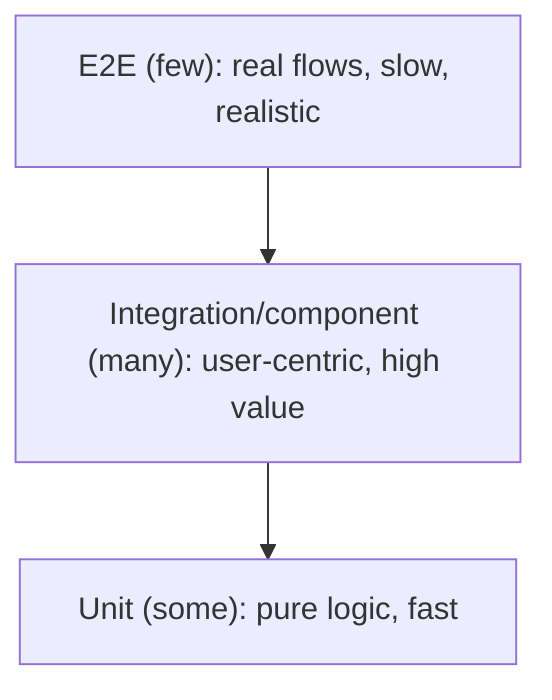

# Frontend Testing Strategy

## Concept

- A **frontend testing strategy** decides what to test, at what level, to gain confidence that the UI works — balancing speed, realism, and maintenance cost.
- The classic levels (the **testing pyramid**, or the more frontend-apt **testing trophy**):
  - **Unit tests** — pure functions, hooks, utils. Fast, isolated, many.
  - **Component/integration tests** — render a component (or several together) and assert behavior from the **user's perspective** (Testing Library: query by role/text, simulate clicks). The highest-value layer for frontends.
  - **End-to-end (E2E)** tests — drive a real browser through full user flows (Playwright, Cypress). Most realistic, slowest, fewest.
  - **Visual regression** — screenshot diffs to catch unintended UI changes.
  - **Accessibility tests** — automated a11y checks (axe) integrated into the above.
- Modern guidance (the "trophy") emphasizes **integration tests** as the sweet spot — realistic confidence without E2E's flakiness/cost.

## Problem It Solves

- Catches regressions before users do, enabling confident refactoring and continuous deployment (ties to frontend CI/CD, topic 29).
- The right mix gives **confidence proportional to cost**: fast feedback from unit/integration tests, plus a few E2E tests covering critical journeys.
- User-centric component tests verify behavior the way users actually experience it, not brittle implementation details.

## Trade-offs

- **Realism vs. speed/stability** — E2E tests are the most realistic but slow and **flaky** (timing, network, environment); over-relying on them yields a slow, unreliable suite. Keep E2E focused on critical paths.
- **Implementation-detail tests are brittle** — testing internal state/props (e.g., enzyme-style shallow rendering) breaks on every refactor; testing **behavior via the DOM** (Testing Library) is robust. Prefer "query by what the user sees."
- **Coverage vs. value** — 100% coverage of trivial code is low-value; prioritize critical flows and complex logic. Coverage is a guide, not a goal.
- **Mocking vs. realism** — mocking the network (MSW) makes tests fast and deterministic but can drift from the real API; contract tests or some real-integration coverage mitigate this.
- **Maintenance cost** — every test is code to maintain; flaky or low-value tests erode trust in the suite.

## Examples

- **Component/integration test**
  - Render `<LoginForm>`, type into fields by label, click "Sign in," assert an error message appears on bad credentials — using React Testing Library + MSW to mock the auth API.
- **Critical-path E2E**
  - Playwright drives the real browser: sign up → add to cart → checkout → see confirmation. Run on CI for the few flows whose breakage is catastrophic.
- **Visual regression**
  - Chromatic/Percy snapshots the design-system components and key pages, flagging unintended visual diffs in PRs.
- **A11y in tests**
  - `jest-axe` asserts components have no detectable accessibility violations as part of component tests (topic 24).
- **Interview framing**
  - Propose a testing **trophy**: lots of user-centric integration/component tests (Testing Library + MSW), unit tests for complex logic, a few E2E tests for critical journeys, plus visual + a11y checks — and explicitly avoid brittle implementation-detail tests and E2E over-reliance. Tying the strategy to confident CI/CD shows you test to ship safely, not to chase coverage.
