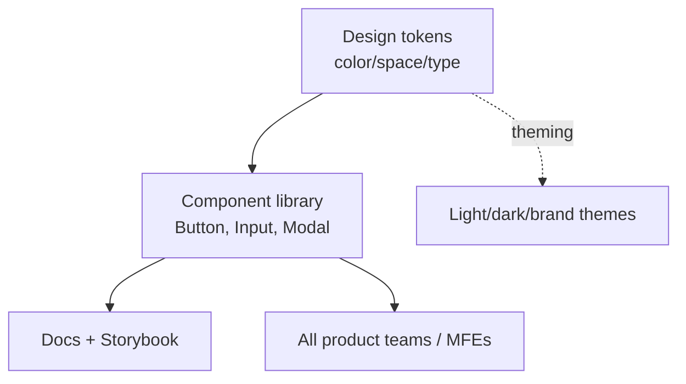

# Design Systems

## Concept

- A **design system** is a single source of truth for an organization's UI: a library of **reusable, documented components** plus the **design tokens** (color, spacing, typography, radius, shadows), patterns, and guidelines that define how products look and behave.
- It has several layers:
  - **Design tokens**: named design decisions (`color.primary`, `space.4`) as data, shared between design (Figma) and code; the foundation for theming and consistency.
  - **Component library**: accessible, tested, themeable building blocks (Button, Input, Modal) implemented once.
  - **Documentation**: usage guidelines, do/don't, live examples (Storybook).
  - **Governance**: how components are proposed, reviewed, versioned, and adopted.
- It's typically owned by a platform/design-system team and consumed by all product teams (and all micro frontends, topic 20).

## Problem It Solves

- **Consistency at scale**: every team uses the same components and tokens, so the product looks and behaves coherently instead of 12 slightly-different buttons.
- **Velocity**: teams assemble UIs from ready-made, accessible, tested components instead of rebuilding primitives, shipping faster.
- **Accessibility & quality baked in**: a11y, keyboard support, and edge cases are solved once in the shared components (topic 24), not re-litigated per team.
- **Theming**: tokens enable light/dark/brand theming by swapping values, not rewriting components.
- **Design - engineering alignment**: shared tokens/components close the gap between Figma and code.

## Trade-offs

- **Consistency vs. flexibility**: a strict system speeds common cases but can frustrate teams with unusual needs; good systems provide escape hatches (composition, style props) without encouraging divergence.
- **Upfront & ongoing cost**: building and *maintaining* a design system is a real, funded effort (a team, versioning, migrations); an under-resourced system rots and gets bypassed.
- **Versioning & adoption**: rolling out breaking component changes across many consumers is hard (needs semver, codemods, migration guides); fragmentation across versions undermines consistency.
- **Governance overhead**: too rigid and teams route around it; too loose and it sprawls. Needs a contribution model.
- **Token discipline**: tokens only help if teams use them instead of hardcoding values; requires linting/conventions.

## Examples

- **Token-driven theming**
  - Components read `var( - color-primary)`; switching the token set yields dark mode or a white-label brand with zero component changes.
- **Storybook as the workshop**
  - Each component is developed, documented, visually tested (topic 22), and a11y-checked in Storybook, serving as living documentation for all teams.
- **Accessible primitives**
  - The shared `<Modal>` handles focus trapping, ESC-to-close, and ARIA roles once, so every product gets accessibility for free (topic 24).
- **Public examples**
  - Material Design, Carbon (IBM), Polaris (Shopify), and Primer (GitHub) are mature, documented design systems.
- **Interview framing**
  - For multi-team or large frontends, propose a design system: tokens as the foundation, accessible/tested components, Storybook docs, and governance/versioning for adoption. Connecting it to consistency, velocity, baked-in a11y, and as the prerequisite for micro frontends demonstrates platform-level frontend thinking.
