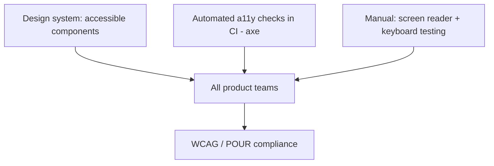

# Accessibility (a11y) at Scale

## Concept

- **Accessibility (a11y)** ensures web apps are usable by everyone, including people who use assistive technologies (screen readers, keyboard-only navigation, switch devices) or have visual, motor, auditory, or cognitive differences. "At scale" means making it **systematic** across a large app/org, not a per-page afterthought.
- The framework is **WCAG** (Web Content Accessibility Guidelines), organized around **POUR**: content must be **Perceivable, Operable, Understandable, Robust**.
- The technical pillars:
  - **Semantic HTML** — use the right elements (`<button>`, `<nav>`, `<h1>`); they bring built-in accessibility (focus, roles, keyboard).
  - **ARIA** — attributes (`aria-label`, `role`, `aria-live`) to convey meaning when semantics aren't enough — used sparingly and correctly ("no ARIA is better than bad ARIA").
  - **Keyboard navigation** — everything operable without a mouse; visible focus indicators; logical focus order; focus management in modals/SPAs.
  - **Color contrast & non-color cues**, **alt text**, **form labels**, **live-region announcements** for dynamic updates.
- "At scale": bake a11y into the **design system** (topic 23), automate checks in **CI** (axe), and establish standards/training.

## Problem It Solves

- Makes the product usable by the ~15%+ of users with disabilities — an inclusion and often **legal requirement** (ADA, Section 508, EAA); inaccessible apps exclude users and create legal exposure.
- Accessibility improvements (semantic structure, keyboard support, clear contrast) also benefit *all* users and improve SEO and overall UX quality.
- Systematizing a11y prevents the endless, expensive cycle of retrofitting accessibility page by page.

## Trade-offs

- **Automated vs. manual testing** — automated tools (axe) catch only ~30–50% of issues (missing labels, contrast); real coverage requires **manual screen-reader and keyboard testing**, which is slower and needs expertise. Both are necessary.
- **Retrofit vs. build-in cost** — adding a11y after the fact is far more expensive than building it into the design system and components from the start; the scalable path is upstream investment.
- **ARIA misuse** — incorrect ARIA actively *harms* accessibility (worse than none); semantic HTML should be the default, ARIA the exception.
- **Velocity tension** — teams under deadline pressure may treat a11y as optional; making it part of "definition of done," CI gates, and the component library removes that tension.
- **SPA challenges** — client-side routing breaks default focus/announcement behavior; needs explicit focus management and live regions.

## Examples

- **Accessible-by-default components**
  - The design system's `<Modal>` traps focus, restores focus on close, sets `role="dialog"` + `aria-modal`, and closes on ESC — every team inherits correct behavior (topic 23).
- **CI gate**
  - `jest-axe` in component tests and Playwright + axe in E2E fail the build on new violations, preventing regressions (topic 22).
- **Keyboard + screen reader pass**
  - Critical flows are manually tested with VoiceOver/NVDA and keyboard-only to catch issues automation misses (focus traps, unclear announcements).
- **SPA route change**
  - On navigation, focus moves to the new page's heading and an `aria-live` region announces the change, so screen-reader users aren't lost.
- **Interview framing**
  - For a11y at scale, describe the systematic approach: semantic HTML + correct (sparing) ARIA, keyboard operability and focus management, contrast, **accessibility built into the design system**, automated checks in CI **plus** manual screen-reader testing, and a11y in the definition of done. Noting automation's ~30–50% ceiling shows you understand real accessibility, not checkbox compliance.
