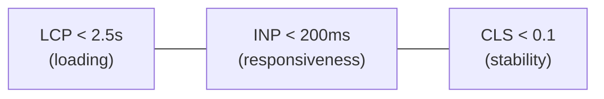

# Frontend Performance

## Concept

- **Frontend performance** is the discipline of making web apps load fast and respond instantly. It's measured by **user-centric metrics**, primarily Google's **Core Web Vitals**:
  - **LCP (Largest Contentful Paint)** — loading: when the main content renders (target < 2.5s).
  - **INP (Interaction to Next Paint)** — responsiveness: how quickly the UI responds to input (target < 200ms). (Replaced FID in 2024.)
  - **CLS (Cumulative Layout Shift)** — visual stability: how much content jumps (target < 0.1).
- Performance work spans the whole pipeline this phase covers: the critical rendering path (topic 2), JS payload (code splitting, topic 8), images/fonts (topics 10–11), rendering strategy (topic 3), and runtime smoothness (rendering pipeline, topic 1).
- The method is **measure → diagnose → fix → monitor**: use lab tools (Lighthouse) and **field/RUM data** (topic 28), find the bottleneck, fix it, and guard against regressions with performance budgets in CI.

## Problem It Solves

- Performance directly affects **business outcomes**: faster pages convert better, rank higher (Core Web Vitals are an SEO factor), and retain users; every 100ms matters at scale.
- Gives objective, user-centric targets to optimize toward instead of vague "make it fast," and a shared language (LCP/INP/CLS) across design, eng, and product.
- Ensures the app is usable on **real devices and networks** (mid-range phones, slow connections), not just the developer's fast laptop.

## Trade-offs

- **Lab vs. field metrics** — Lighthouse (lab) is reproducible but synthetic; **RUM** (field, topic 28) reflects real users but is noisier. Optimize for field data; use lab for debugging. They often disagree.
- **Optimize the bottleneck, not everything** — perf work has diminishing returns; profile to find what actually limits *this* page (often JS for apps, images for content sites) rather than micro-optimizing everywhere.
- **Performance vs. features/DX** — rich features, heavy libraries, and third-party scripts add weight; teams must budget JS and justify dependencies. Convenience (a big UI library) can cost users.
- **INP is about the main thread** — responsiveness suffers from long JS tasks; fixing it means breaking up work, deferring, or offloading to workers (topic 12) — sometimes at the cost of code simplicity.
- **CLS vs. dynamic content** — ads, embeds, and lazy media cause shifts; reserving space (topics 9–11) constrains layout flexibility.

## Examples

- **Diagnosing LCP**
  - LCP is the hero image; fixes: preload it, serve AVIF at the right size (topic 10), and ensure it isn't lazy-loaded — pushing LCP under 2.5s.
- **Fixing INP**
  - A heavy click handler blocks the main thread; break the work into smaller tasks, debounce, or move computation to a Web Worker (topic 12) so the UI responds within 200ms.
- **Eliminating CLS**
  - Set `width`/`height` on images, reserve space for ads/embeds, and use `font-display`/metric-matched fallbacks (topic 11) so nothing jumps.
- **Performance budget in CI**
  - CI fails the build if the JS bundle exceeds a threshold or Lighthouse scores drop, preventing regressions (topic 29).
- **Interview framing**
  - Anchor frontend performance on Core Web Vitals (LCP/INP/CLS), then map each to concrete fixes from this phase (critical CSS, code splitting, image/font optimization, main-thread work, reserved layout). Emphasizing **field/RUM measurement** and **performance budgets in CI** shows you treat performance as a continuously-monitored property, not a one-off audit.
