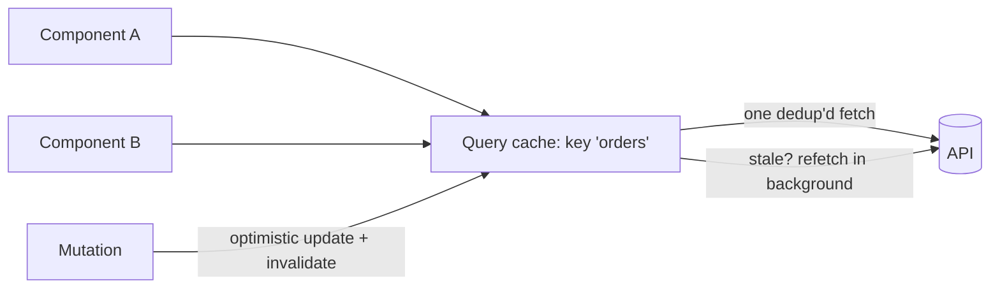

# Client Data Fetching & Caching

## Concept

- **Client data fetching & caching** is the layer that manages **server state** in the browser: fetching data from APIs, caching it, keeping it fresh, and synchronizing it with the UI. In modern apps this is the single most important architectural concern, and it's distinct from client/UI state (topic 7).
- Naively, teams fetch in `useEffect` and store results in a global store — which forces them to hand-roll caching, loading/error flags, deduplication, refetching, and invalidation, badly. **Server-state libraries** (TanStack Query/React Query, SWR, Apollo, RTK Query) solve this as a category.
- What they provide out of the box:
  - **Caching** keyed by query key, with configurable staleness (`staleTime`).
  - **Request deduplication** — many components requesting the same data trigger one fetch.
  - **Background refetching** — refetch on window focus, reconnect, or interval to stay fresh.
  - **Loading/error/success states** and retries with backoff.
  - **Mutations** with **optimistic updates** and **cache invalidation** on success.
  - **Pagination/infinite queries** and prefetching.

## Problem It Solves

- Eliminates the buggy, repetitive boilerplate of manual fetching (loading flags, race conditions, duplicate requests, stale data, manual cache invalidation) — replacing dozens of lines per query with a declarative hook.
- **Correct server-state semantics**: data is cached, deduplicated, kept fresh automatically, and invalidated on mutation — so the UI shows accurate, current data without manual wiring.
- Improves perceived performance (instant cache hits, optimistic updates, prefetching) and resilience (retries, refetch on reconnect).

## Trade-offs

- **Library power vs. another abstraction** — these libraries add a dependency and concepts (query keys, stale/cache times, invalidation) to learn; for a tiny app with one fetch, plain `fetch` may suffice — but the threshold is low.
- **Cache staleness tuning** — `staleTime`/`cacheTime` control the freshness-vs-request trade-off; too fresh = excessive refetching, too stale = users see old data. Must be set per data type (like TTLs, Phase 2 topic 16).
- **Optimistic updates vs. correctness** — instant updates need correct rollback on failure and careful cache reconciliation; getting it wrong shows inconsistent state.
- **Cache invalidation is still hard** — deciding *which* queries a mutation invalidates is the classic hard problem; over-invalidation refetches too much, under-invalidation shows stale data.
- **Don't duplicate server state in a global store** — mixing React Query with Redux-for-server-data reintroduces the problems the library solves; keep server state in the query cache and only client state in a store (topic 7).

## Examples

- **Query + mutation**
  - `useQuery(['orders', userId], fetchOrders)` caches and dedups; `useMutation(updateOrder, { onSuccess: () => queryClient.invalidateQueries(['orders']) })` updates the server and refreshes the cached list.
- **Optimistic update**
  - A "mark as read" mutation updates the cache immediately and rolls back if the request fails — instant UX with correctness on error (pairs with error boundaries, topic 21).
- **Background freshness**
  - A dashboard refetches on window focus and every 30s, so returning to the tab shows current data without a manual reload.
- **Prefetch on intent**
  - Hovering a row prefetches its detail query, so opening the detail view is instant (pairs with code splitting/lazy loading, topics 8–9).
- **Interview framing**
  - When asked how the frontend gets and manages data, name server state as a distinct concern and propose a query library (React Query/SWR) for caching, dedup, background refetch, and optimistic mutations — explicitly *not* a global store. Discussing staleTime tuning and cache invalidation as the hard parts is exactly the modern frontend-architecture signal that's often missing from candidates.
