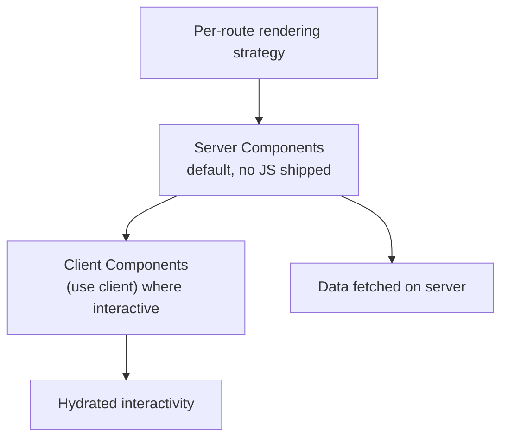

# React Architecture at Scale

## Concept

- This topic is about structuring **large React applications** so they stay performant, maintainable, and ownable by many engineers — bringing together rendering strategy, component design, data flow, and the modern **React Server Components (RSC)** model.
- Key architectural decisions at scale:
  - **Server vs. Client Components (RSC)** — in the modern model (Next.js App Router), components render on the **server by default** (no JS shipped), and you opt into client interactivity (`"use client"`) only where needed. This minimizes the JS bundle and pushes data fetching to the server.
  - **Rendering strategy per route** (topic 3) — static, server-rendered, or client-rendered per page.
  - **Component composition** — composition over prop-drilling/inheritance; colocate state with where it's used; lift only when shared (topic 6).
  - **Boundaries** — Suspense boundaries (topic 4) for streaming/loading, error boundaries (topic 21) for resilience, feature module boundaries for ownership.
  - **Performance discipline** — memoization where it matters, avoiding unnecessary re-renders, code splitting (topic 8), and keeping client bundles small.

## Problem It Solves

- Keeps large React apps **fast** by shipping less JavaScript: server components render to HTML without sending component code to the browser, attacking the bundle-size/TTI problem that plagues big SPAs.
- Provides a **clear structure** for many teams: feature modules, explicit boundaries, and a server/client split that makes data and interactivity boundaries obvious.
- Pushes data fetching and heavy logic to the server (closer to data, secure, cacheable), while keeping rich interactivity on the client where it belongs.

## Trade-offs

- **RSC power vs. complexity & maturity** — the server/client component model is powerful but adds a new mental model (what runs where, the `"use client"` boundary, serialization limits) and is tightly coupled to specific frameworks/versions; it's still maturing and can be confusing.
- **Server rendering cost** — moving rendering server-side needs server infrastructure and adds server load/latency vs. pure-static (the SSR trade-offs of topic 3 apply).
- **Over-memoization** — sprinkling `useMemo`/`React.memo` everywhere adds complexity and can hurt more than help; memoize measured hotspots, not reflexively. (React Compiler aims to automate this.)
- **Boundary discipline** — without clear feature/module boundaries and lint enforcement, a large React app still degrades into tangled imports (topic 6).
- **State sprawl** — at scale, mixing too many state tools (context, Redux, query libs) without a clear taxonomy (topic 7) causes confusion; be deliberate.

## Examples

- **Server + client split (Next.js App Router)**
  - A product page is a server component that fetches data and renders HTML (no JS for the static parts); the `<AddToCart>` button is a `"use client"` component — only it ships JS. This minimizes bundle size for a mostly-static page.
- **Streaming + Suspense**
  - The page streams the fast content and wraps the slow reviews section in `<Suspense>` so it streams in later (topic 4), improving LCP.
- **Feature-module structure**
  - Each feature owns its server/client components, data access, and tests; shared UI comes from the design system (topic 23); lint rules enforce boundaries.
- **Targeted performance**
  - Profiler identifies a list re-rendering on every keystroke; a memoized row + stable callbacks fixes it — applied surgically, not globally.
- **Interview framing**
  - For a large React app, discuss the server/client component split (ship JS only where interactive), per-route rendering strategy, Suspense/error boundaries, feature-module ownership, and disciplined state + memoization. Framing RSC as a bundle-size and data-locality solution — while acknowledging its complexity and maturity — is the current senior/Staff frontend signal.
