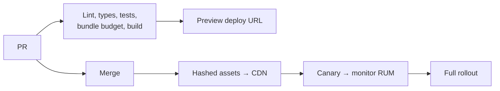

# Frontend CI/CD & Deployment

## Concept

- **Frontend CI/CD** is the pipeline and deployment model for shipping web frontends safely and fast. Frontend deployment has distinct properties from backend: the artifact is **static assets** (HTML/JS/CSS) served from a **CDN**, and clients may run **old cached versions** for a while after a deploy.
- A typical frontend pipeline:
  - **CI** — lint, type-check, unit/integration tests (topic 22), build, bundle-size/performance budgets (topic 25), visual + a11y checks.
  - **Preview deployments** — every PR gets a unique, shareable URL with the built app for review/QA (Vercel, Netlify, etc.).
  - **Build & asset deployment** — produce **content-hashed** immutable assets, upload to object storage/CDN, then atomically switch the entry HTML to reference the new assets.
  - **Progressive rollout** — release to a fraction of users (canary), feature-flag risky changes (Phase 6), and monitor RUM/errors (topic 28) before full rollout.
- The deployment unit is assets + a CDN, so **caching and versioning** dominate the design.

## Problem It Solves

- Ships frontend changes **frequently and safely** with automated quality gates (tests, type-checks, performance budgets) catching regressions before users.
- **Preview deploys** make review concrete — reviewers and stakeholders see the actual running change, not just code.
- **Atomic, cache-safe deploys** ensure users never get a broken mix of old and new assets, and that a deploy can be rolled back instantly (just point HTML back to the old assets).
- **Progressive rollout + monitoring** limits the blast radius of a bad release.

## Trade-offs

- **Caching vs. freshness (the core frontend deploy problem)** — assets must be cached aggressively (immutable, content-hashed, 1-year TTL) for speed, but the entry HTML must be near-uncached so users get the new version promptly. Getting this wrong serves stale or broken apps. Content hashing + short-TTL HTML solves it.
- **In-flight users on old code** — during/after a deploy, some users run the previous bundle; lazy-loaded chunks referenced by old HTML must still exist (don't delete old assets immediately) or users hit chunk-load errors. Keep old assets around and handle chunk-load failures (topic 21).
- **Backward compatibility** — the new frontend and the (possibly old) backend must be compatible during rollout, and vice versa (mirrors backend migration concerns, Phase 3 topic 12).
- **Speed vs. thorough gates** — more CI checks (E2E, visual) catch more but slow the pipeline; balance with fast feedback (run heavy checks in parallel / only on affected projects, topic 18).
- **Rollback strategy** — instant rollback requires keeping previous asset versions and an easy pointer swap; design for it.

## Examples

- **Atomic asset deploy**
  - Build emits `app.[hash].js`; assets upload to the CDN with immutable 1-year caching; then `index.html` (short TTL) is updated to reference the new hashes — an atomic switch with instant rollback by reverting the HTML.
- **Preview per PR**
  - Each PR auto-deploys to `pr-1234.preview.app.com` for QA and stakeholder sign-off before merge.
- **Bundle budget gate**
  - CI fails if the main bundle grows beyond a set KB budget, preventing performance regressions from creeping in (topic 25).
- **Canary + flags**
  - A risky redesign ships behind a feature flag to 5% of users; RUM/error dashboards (topic 28) are watched before ramping to 100%.
- **Interview framing**
  - For shipping a frontend, describe CI gates (tests, types, bundle/perf budgets, a11y), preview deployments, content-hashed immutable assets on a CDN with short-TTL HTML for atomic cache-safe deploys, keeping old chunks for in-flight users, and progressive rollout with RUM monitoring. The caching/versioning and stale-chunk reasoning is the distinctly-frontend production insight interviewers look for.
