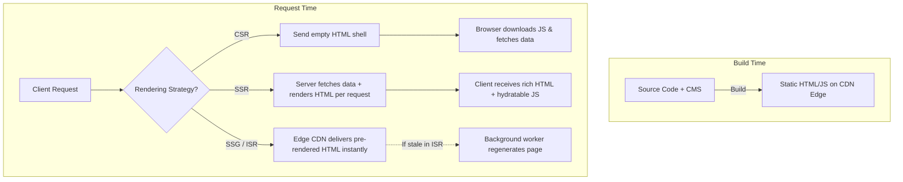

# CSR vs SSR vs SSG vs ISR

## Concept

- Modern web applications choose between four primary rendering architectures based on the trade-offs among latency, SEO, server compute costs, and content dynamism:
  1. **Client-Side Rendering (CSR)**: The server sends a bare-bones HTML shell (`<div id="root"></div>`) and a JS bundle. The browser downloads the JS, parses it, executes the UI framework, fetches data from APIs, and renders the DOM entirely on the client.
  2. **Server-Side Rendering (SSR)**: For *every* incoming request, a Node.js/edge server fetches the required data, renders the component tree to an HTML string, and streams or sends fully populated HTML to the browser. The client paints immediately and runs a hydration pass to attach event listeners.
  3. **Static Site Generation (SSG)**: Pages are pre-rendered into static HTML, CSS, and JS files *ahead of time at build/deploy time*. Static files are deployed to a global CDN edge, delivering sub-50ms TTFB.
  4. **Incremental Static Regeneration (ISR)**: Pre-renders pages statically at build time (like SSG), but allows the CDN to regenerate individual static pages in the background on incoming requests after a `revalidate` cache duration (stale-while-revalidate pattern), without re-building the entire site.



## Problem It Solves

- Solves the tension between **developer ergonomics** (component-based frameworks like React/Vue) and **real-world web performance** (fast Time-To-First-Byte, instant First Contentful Paint, search engine indexing, and resilience on low-powered mobile devices).

## Trade-offs

| Criterion | CSR | SSR | SSG | ISR |
|---|---|---|---|---|
| **TTFB (Time to First Byte)** | Fast (static shell from CDN) | Slow (blocked on server data fetches) | Fastest (edge cached) | Fastest (edge cached) |
| **FCP & LCP** | Slow (blank until JS runs + fetches) | Fast (rich HTML painted early) | Fastest (HTML ready instantly) | Fastest (HTML ready instantly) |
| **SEO Indexing** | Risky (relies on crawler JS execution) | Excellent (full HTML in response) | Excellent (full HTML in response) | Excellent (full HTML in response) |
| **Server Cost / Load** | Lowest (cheap static CDN hosting) | Highest (CPU/memory per request) | Lowest (build-time compute only) | Low (only recomputes when stale) |
| **Data Freshness** | Always fresh (client queries live APIs) | Always fresh (rendered on request) | Stale (requires full site rebuild) | Eventually consistent (stale-while-revalidate) |
| **Personalization** | Easy (per-user state loaded in browser) | Easy (reads request headers/cookies) | Difficult (requires client-side overlays) | Difficult (same static page for all) |

## Examples

- **Decision Framework by Workload**
  - **Authenticated Enterprise Dashboard / Admin Portal**: **CSR** (Vite / SPA). SEO is irrelevant; pages are behind login; instant client-side tab switching outweighs initial bundle download.
  - **Social Feed / User Profile with Live Cookies**: **SSR** (Next.js `getServerSideProps` or React Server Components). Highly dynamic, personalized data with strict SEO requirements.
  - **Documentation Site / Company Marketing Blog**: **SSG** (Astro / Next.js static export). Content changes infrequently; maximum security, lowest hosting cost, global CDN distribution.
  - **E-Commerce Catalog (500,000 Products)**: **ISR**. Building 500k pages at compile time would take hours. With ISR, popular products are pre-rendered at build, rare products are generated on-demand at first request, and updates revalidate every 60 seconds via `stale-while-revalidate`.

- **ISR in Action (`stale-while-revalidate`)**
  ```typescript
  // Next.js page with ISR
  export async function getStaticProps() {
    const res = await fetch('https://api.store.com/products');
    const products = await res.json();

    return {
      props: { products },
      revalidate: 60, // Regenerate page in background if request arrives after 60s
    };
  }
  ```

- **Interview Framing**
  - Never state that one rendering strategy is "strictly best." Frame your answer as a **multi-dimensional trade-off matrix**: balance **content dynamism & personalization** against **TTFB, infrastructure cost, and SEO**. A Staff engineer champions a hybrid architecture: e.g., e-commerce uses SSG/ISR for marketing & product catalog pages, SSR for user checkout/cart, and CSR for internal merchant administration dashboards.
