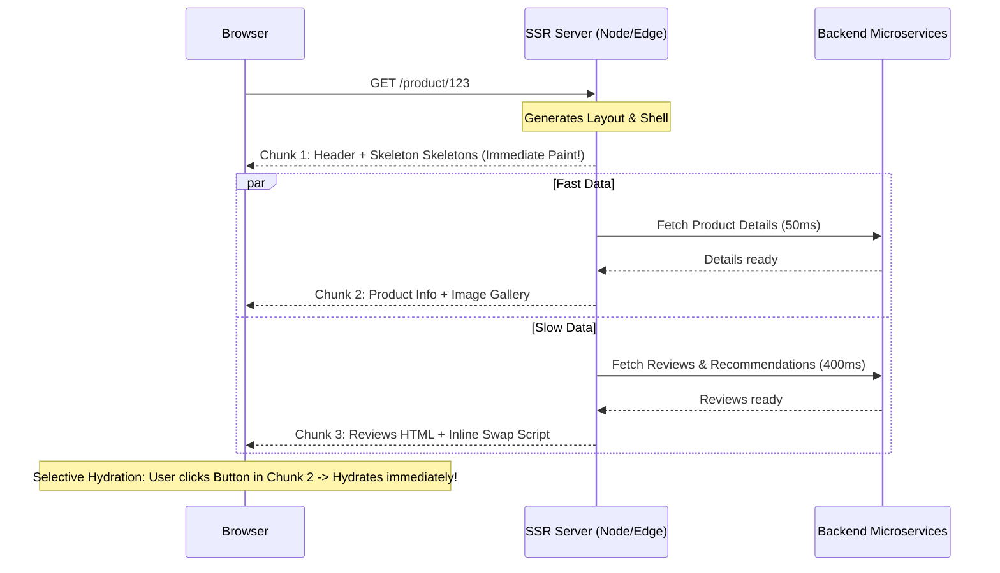

# Streaming SSR and Partial Hydration

## Concept

- Traditional Server-Side Rendering suffered from an **"all-or-nothing" bottleneck**:
  1. The server could not send *any* HTML until *all* backend microservices and database queries finished.
  2. The browser could not display *any* UI until the entire HTML document was downloaded.
  3. The user could not interact with *any* button until the entire client JavaScript bundle was downloaded and hydrated (walking the full DOM tree to attach event listeners).
- **Streaming SSR** breaks this bottleneck using **HTTP Chunked Transfer Encoding** (`Transfer-Encoding: chunked`). The server flushes initial HTML shell (nav, header, layout skeletons) immediately, then streams in slow components (reviews, recommendation carousels) as separate HTML chunks as their promises resolve, swapping them into place via inline `<template>` and small inline scripts.
- **Partial & Selective Hydration**:
  - Instead of freezing the main thread to hydrate the entire page in one massive CPU block, modern frameworks hydrate individual subtrees independently inside React `<Suspense>` boundaries.
  - **Selective Hydration**: If a user clicks on an unhydrated component while another component is hydrating, React pauses the background hydration and prioritizes hydrating the clicked component immediately to respond to user intent.
  - **Islands Architecture (Astro / Fresh)**: Takes this further by rendering 95% of the page as pure, zero-JS static HTML, shipping micro-bundles ("islands") only for interactive widgets (e.g., an interactive search bar or cart widget).



## Problem It Solves

- Eliminates the **"uncanny valley"** of web apps - where a page looks fully loaded and rendered, but user taps and clicks are completely unresponsive because the browser's main thread is locked in full-page hydration.
- Prevents slow backend microservices or third-party APIs from blocking TTFB for the rest of the application.

## Trade-offs

- **Server-Side Backpressure & Memory**:
  - Streaming keeps HTTP connections open longer while waiting for slow promises. If thousands of concurrent users connect, server thread pools and memory buffers must handle long-lived chunked streams.
- **Hydration Mismatch Errors**:
  - If server-rendered markup does not match the initial client-computed virtual DOM (e.g., rendering `new Date()` or reading `window.innerWidth`), React throws hydration errors and is forced to discard and re-render the entire subtree on the client.
- **SEO Considerations**:
  - While major search engine crawlers (Googlebot) wait for streaming chunks to complete, smaller social crawlers (Twitter/Discord unfurl bots) may read only the initial streamed chunk (meaning OpenGraph tags must be sent in the synchronous `<head>` chunk).

## Examples

- **React 18+ `<Suspense>` with Server Streaming**
  ```tsx
  // app/product/page.tsx
  import { Suspense } from 'react';

  export default function ProductPage() {
    return (
      <div className="product-layout">
        {/* Streamed immediately in Chunk 1 */}
        <Header />
        <ProductDetails />

        {/* Streamed later when slow promise resolves; shows fallback instantly */}
        <Suspense fallback={<ReviewsSkeleton />}>
          <SlowReviews />
        </Suspense>
      </div>
    );
  }
  ```

- **Selective Hydration Prioritization**
  - If `<ProductDetails />` and `<SlowReviews />` are both hydrating in the background, but the user clicks the "Add to Cart" button in `<ProductDetails />`, the React scheduler intercepts the native event, prioritizes the `<ProductDetails />` fiber tree, attaches listeners, and replays the click event seamlessly without dropping the input.

- **Interview Framing**
  - Highlight how Streaming SSR and Selective Hydration decouple the three historical frontend coupled stages: **Data Fetching, HTML Rendering, and JS Hydration**. In system design interviews for high-traffic media or e-commerce apps (e.g., Amazon or YouTube), propose streaming the visual shell + hero content in sub-100ms, streaming comments/recommendations out-of-order via Suspense boundaries, and adopting Islands Architecture to avoid shipping hundreds of kilobytes of unused framework runtime to clients.
