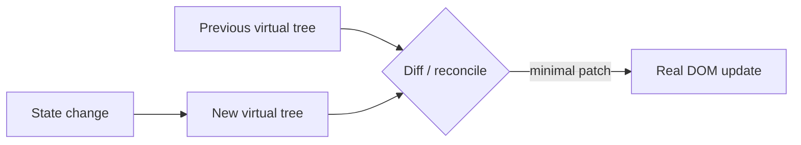

# Virtual DOM

## Concept

- The **Virtual DOM (VDOM)** is an in-memory representation of the UI as a tree of lightweight JavaScript objects. Instead of mutating the real DOM directly (slow), a framework re-renders to a *new* virtual tree, **diffs** it against the previous one, and applies only the **minimal set of real-DOM changes** (reconciliation).
- The motivation: direct DOM manipulation is expensive (each change can trigger layout/paint, topic 1), and hand-writing minimal updates is error-prone. The VDOM lets you write **declarative** UI ("here's what the UI should look like for this state") while the framework computes the efficient updates.
- React's reconciliation uses heuristics (same type → update in place; different type → replace subtree; **keys** to match list items) to keep diffing near O(n).

## Problem It Solves

- **Declarative UI**: you describe the target UI for each state and let the framework handle updates, instead of manually tracking and mutating DOM nodes (imperative, bug-prone).
- **Batched, minimal updates**: multiple state changes are batched and reconciled into the fewest real-DOM operations, avoiding redundant layouts/paints.
- Makes complex, frequently-updating UIs maintainable and reasonably performant by default.

## Trade-offs

- **Not actually "fast" - it's "fast enough" + ergonomic**: the VDOM adds diffing overhead; raw hand-tuned DOM updates can be faster. Its value is developer productivity and consistent updates, not peak performance.
- **Re-render cost**: a state change can re-render a large subtree (recomputing virtual nodes) even if little changes; you optimize with memoization (`React.memo`, `useMemo`), keys, and avoiding unnecessary re-renders.
- **Alternatives challenge the premise**: **fine-grained reactivity** frameworks (Solid, Svelte, Vue's reactivity) skip the VDOM and update only the exact DOM nodes bound to changed state, often faster with less overhead. Svelte compiles away the framework entirely.
- **Keys matter**: wrong/missing list keys cause incorrect or inefficient reconciliation (re-creating DOM nodes, losing state).

## Examples

- **List reconciliation with keys**
  - Rendering a list with stable `key={item.id}` lets React match items across renders and move/update nodes instead of recreating them; using array index as key causes bugs when the list reorders.
- **Avoiding wasted renders**
  - Wrapping a pure child in `React.memo` and memoizing callbacks prevents it from re-rendering when unrelated parent state changes.
- **Fine-grained alternative**
  - In Solid/Svelte, updating a signal/variable patches exactly the bound text node - no diffing a tree - which can outperform VDOM for update-heavy UIs.
- **Interview framing**
  - Explain the VDOM as a declarative-programming and batched-minimal-update mechanism, not a magic speed boost - and note fine-grained reactivity (Solid/Svelte) as the modern alternative that avoids diffing. Knowing keys and memoization as the practical performance levers shows hands-on depth.
