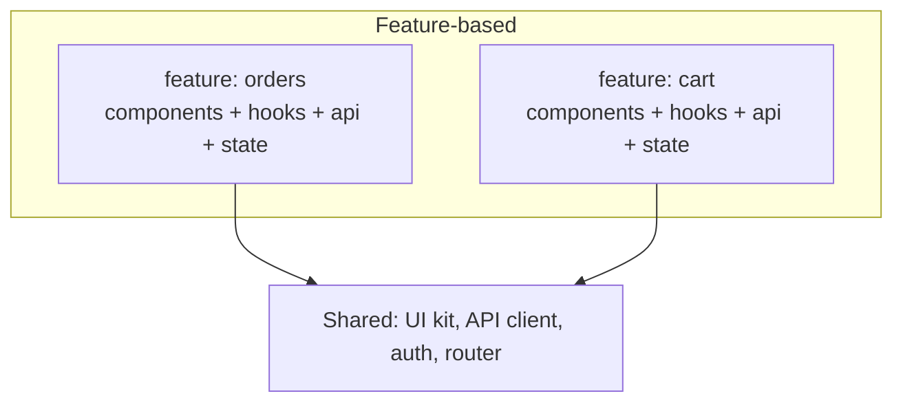

# Frontend Architecture Patterns

## Concept

- As frontend apps grow, **how you structure code** determines whether they stay maintainable. Frontend architecture patterns are the conventions for organizing components, state, data flow, and module boundaries at scale.
- Key organizing dimensions:
  - **Component structure**: atomic design (atoms → molecules → organisms → templates → pages), or feature-based grouping; presentational vs. container components.
  - **Folder structure**: by *type* (all components together, all hooks together) vs. by *feature/domain* (each feature owns its components, hooks, state, API) - feature-based scales far better.
  - **Data flow**: unidirectional (state flows down, events flow up) is the dominant, predictable model (Flux/Redux lineage).
  - **Separation of concerns**: isolate UI, business logic, and data fetching (e.g., logic in hooks/services, UI in dumb components) - the frontend echo of clean architecture (Phase 3, topic 27).
  - **Layering**: a clear boundary between the design-system/UI layer, feature modules, and shared infrastructure (API client, auth, routing).

## Problem It Solves

- Prevents the frontend "big ball of mud": tangled components, prop-drilling, scattered state, and logic duplicated across the app.
- Makes large codebases navigable and ownable - feature-based structure maps modules to teams (Conway's Law applies to frontends too).
- Keeps business logic testable and UI swappable by separating concerns, and keeps the dependency direction sane (features depend on shared infra, not each other).

## Trade-offs

- **By-type vs. by-feature**: by-type is fine for small apps but scatters a feature's code across many folders as it grows; by-feature colocates related code and scales, at the cost of some duplication and upfront structure.
- **Abstraction vs. simplicity**: strict layering and separation help large apps but add ceremony that's overkill for small ones.
- **Shared vs. duplicated**: over-sharing creates coupling (a change to a shared component breaks many features); under-sharing duplicates. The design-system layer (topic 23) and clear shared boundaries manage this.
- **Prop drilling vs. global state**: passing props deep is explicit but tedious; reaching for global state/context everywhere creates hidden coupling and re-render issues (topic 7) - use the right tool per scope.

## Examples

- **Feature-based structure**
  - `/features/checkout/{components, hooks, api, store, types}` keeps everything for checkout together and owned by one team; `/shared/{ui, api-client, auth}` holds cross-cutting infra.
- **Container/presentational split**
  - A `useOrders()` hook holds fetching/logic; a pure `<OrderList items />` renders - the list is trivially testable and reusable with different data sources (clean-architecture parallel).
- **Unidirectional flow**
  - State lives in a store/context; components dispatch actions/events upward and receive new state downward - predictable, debuggable data flow.
- **Module boundaries**
  - Lint rules forbid one feature importing another feature's internals (only shared and public APIs), preventing tangled cross-feature dependencies (echoing the modular monolith, Phase 3 topic 2).
- **Interview framing**
  - For a large frontend, propose feature-based organization with a shared UI/design-system layer, unidirectional data flow, and separation of data/logic/UI (logic in hooks/services). Tying boundaries to team ownership and enforcement (lint rules) shows you think about frontend *architecture*, not just components.
