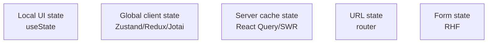

# State Management

## Concept

- **State management** is how a frontend app stores, updates, and shares data across components. The central skill is recognizing that not all state is the same — different *kinds* of state need different tools.
- The key taxonomy:
  - **Local/UI state** — a toggle, input value, modal open/closed. Lives in the component (`useState`). Keep it as local as possible.
  - **Shared/global client state** — theme, auth user, cart — needed by many components. Use context or a state library (Redux, Zustand, Jotai).
  - **Server state (server cache state)** — data fetched from an API. It's fundamentally different: it lives on the server, can be stale, needs caching/refetching/invalidation. Use a data-fetching library (React Query/SWR — topic 26), *not* a generic global store.
  - **URL state** — filters, pagination, selected tab — belongs in the URL (shareable, back-button friendly).
  - **Form state** — often complex enough for dedicated tools (React Hook Form).
- The biggest modern insight: **don't put server state in Redux**. Most "global state" pain disappears when server cache state is handled by a query library and only true client state goes in a store.

## Problem It Solves

- Avoids two opposite failure modes: **prop-drilling** (passing data through many layers) and a **bloated global store** holding everything (causing tangled coupling and excessive re-renders).
- Matching each state type to the right tool keeps updates predictable, components decoupled, and performance manageable.
- Correctly separating server state from client state removes most of the boilerplate and bugs (manual loading flags, cache invalidation, stale data) that plague hand-rolled global stores.

## Trade-offs

- **Global store power vs. overhead** — Redux gives predictable, debuggable, middleware-rich state but is verbose and easy to overuse; lighter libraries (Zustand, Jotai) reduce boilerplate; context is built-in but causes broad re-renders if misused.
- **Context re-render trap** — putting frequently-changing values in a single React context re-renders all consumers; split contexts or use a store with selectors.
- **Server state in a store = bugs** — manually caching API data in Redux means reimplementing caching, deduping, refetching, and invalidation badly; a query library does this correctly (topic 26).
- **Locality vs. sharing** — lifting state too high causes needless re-renders and coupling; keep state as local as possible and lift only when genuinely shared.
- **Too many tools** — using Redux + Context + Query + RHF adds cognitive load; pick deliberately per state type.

## Examples

- **Right tool per state**
  - Modal open → `useState`. Auth user/theme → Zustand or context. Product list from API → React Query. Active filters → URL query params. Checkout form → React Hook Form.
- **Selectors to avoid re-renders**
  - With Zustand/Redux, components subscribe to a *slice* via a selector so they re-render only when that slice changes, not on every store update.
- **Server state done right**
  - `useQuery(['orders', userId], fetchOrders)` handles caching, background refetch, loading/error states, and dedup — replacing dozens of lines of manual store logic.
- **Interview framing**
  - When asked about state management, lead with the taxonomy: distinguish local, global client, **server cache**, and URL state, and assign each the right tool. Stating "server state belongs in React Query, not Redux" and explaining the context re-render trap is exactly the modern, senior frontend answer.
