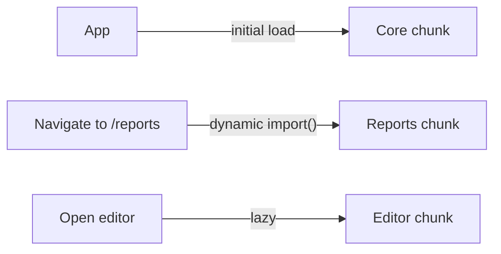

# Code Splitting

## Concept

- **Code splitting** breaks a monolithic JavaScript bundle into smaller **chunks** that are loaded **on demand**, so users download only the code needed for what they're currently viewing — not the entire app upfront.
- As SPAs grow, a single bundle balloons to megabytes, delaying Time-to-Interactive while the browser downloads, parses, and executes code for pages the user may never visit. Code splitting defers that cost.
- The main split points:
  - **Route-based** — each route/page is its own chunk, loaded when navigated to (the highest-impact, easiest win).
  - **Component-based** — heavy components (a charting library, a rich editor, a modal) load lazily when actually rendered.
  - **Vendor splitting** — separate third-party libraries into a chunk that changes rarely and caches well across deploys.
- It's enabled by dynamic `import()`, which bundlers (Webpack, Vite, topic 17) turn into separate chunk files.

## Problem It Solves

- **Faster initial load / TTI** — shipping only the critical code for the first view shrinks the initial bundle, so the page becomes interactive sooner (a core lever for Core Web Vitals on JS-heavy apps).
- **Pay-for-what-you-use** — code for rarely-visited routes or heavy optional features isn't downloaded until needed.
- **Better caching** — vendor/runtime chunks that rarely change stay cached across app deploys, so users re-download only what actually changed.

## Trade-offs

- **Fewer big chunks vs. many small chunks** — too coarse and you ship unused code; too granular and you incur many requests and waterfall delays. Aim for sensible boundaries (per route + heavy components).
- **Lazy loading adds latency on demand** — a lazily-loaded route/component has a load delay when first accessed; mitigate with **prefetching** (load the next likely chunk during idle time) and good loading states (topic 9).
- **Loading-state UX** — split points need fallbacks (skeletons/spinners) and error boundaries (topic 21) for failed chunk loads (e.g., a chunk 404 after a deploy).
- **Waterfalls** — naive nested dynamic imports can serialize loads; preload critical chunks to parallelize.

## Examples

- **Route-based (React)**
  - `const Reports = lazy(() => import('./Reports'))` wrapped in `<Suspense fallback={<Skeleton/>}>` loads the reports bundle only when the user navigates there.
- **Heavy component**
  - A markdown editor or a charting lib is dynamically imported only when the user opens that feature, keeping it out of the initial bundle.
- **Prefetch on intent**
  - Prefetch the `/checkout` chunk when the user hovers the cart or reaches the cart page, so navigation feels instant despite the split.
- **Vendor chunk**
  - Bundler config splits `react`, `lodash`, etc. into a long-cached vendor chunk separate from app code.
- **Interview framing**
  - For JS-heavy app load performance, propose route-based code splitting first, then lazy-load heavy components, with prefetching to hide the on-demand latency and skeletons/error boundaries for UX. Connecting it to TTI and caching shows you optimize the real bottleneck (JS cost), not just image bytes.
