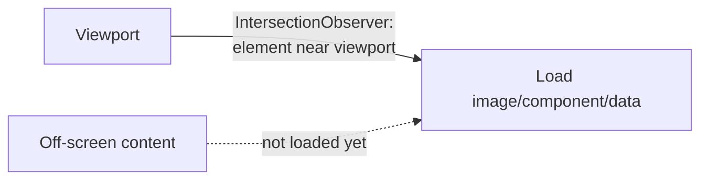

# Lazy Loading

## Concept

- **Lazy loading** defers loading a resource until it's actually needed — typically until it's about to enter the viewport or be used — instead of loading everything upfront.
- It applies to many resource types: **images and iframes** (load when scrolled near), **components/routes** (load on navigation — code splitting, topic 8), **data** (fetch on demand / infinite scroll), and **below-the-fold content** generally.
- The browser now supports image lazy loading natively (`loading="lazy"`), and the **Intersection Observer API** efficiently detects when elements approach the viewport without expensive scroll listeners.
- The opposite technique is **eager loading / prefetching** — loading something *before* it's needed because you predict it will be (e.g., the next page). Good apps combine both: lazy-load what's uncertain, prefetch what's likely.

## Problem It Solves

- **Faster initial load** — the page doesn't download dozens of below-the-fold images or unused components before becoming usable, improving LCP/TTI and saving bandwidth.
- **Lower data cost** — users (especially on mobile/metered connections) only download what they actually view.
- **Less work upfront** — fewer requests and less parsing/decoding competing for the main thread during the critical early moments.

## Trade-offs

- **Saved upfront cost vs. on-demand latency** — lazily-loaded content has a delay when it's needed; if the trigger fires too late (content loads only once fully in view), users see blank/placeholder gaps. Tune the trigger to load *slightly before* needed (a root margin).
- **Layout shift (CLS)** — lazily-loaded images without reserved dimensions cause content to jump as they pop in; always set `width`/`height` or an aspect-ratio box to avoid CLS.
- **Don't lazy-load the LCP element** — lazy-loading the hero/above-the-fold image *delays* LCP; eager-load (even preload) critical above-the-fold media and lazy-load only below-the-fold.
- **SEO/accessibility** — content hidden behind lazy loading must still be crawlable and accessible; ensure it loads for crawlers and assistive tech.

## Examples

- **Native image lazy loading**
  - `` defers off-screen images and reserves space to avoid layout shift.
- **Infinite scroll / data**
  - An Intersection Observer on a sentinel element at the list's end triggers fetching the next page as the user nears the bottom.
- **Lazy component + prefetch**
  - Below-the-fold widgets lazy-load on scroll; the *next* route's chunk is prefetched on link hover so navigation feels instant (combining lazy + eager).
- **Anti-pattern fixed**
  - The hero image was `loading="lazy"`, hurting LCP; switching it to eager (or `fetchpriority="high"`/preload) fixed the metric.
- **Interview framing**
  - Propose lazy loading for below-the-fold images, off-screen components, and paginated data via Intersection Observer — while explicitly *eager*-loading the LCP element and reserving dimensions to avoid CLS. Knowing what *not* to lazy-load is the senior nuance.
