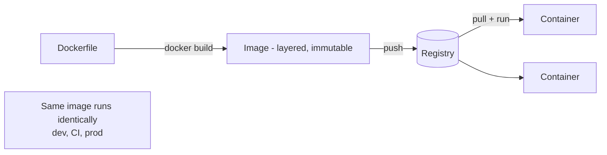

# Docker

## Concept

- **Docker** packages an application together with **all its dependencies** — runtime, libraries, system tools, config — into a portable **container image** that runs identically on any machine with a container runtime. It solves "works on my machine."
- A container is an **isolated process** on a shared host kernel, using Linux primitives (namespaces for isolation, cgroups for resource limits). Unlike a VM (which virtualizes hardware and runs a full guest OS), containers share the host kernel — so they're **lightweight, fast to start, and dense** (many per host).
- Key artifacts: a **Dockerfile** (declarative build recipe), an **image** (immutable, layered, built once), and a **container** (a running instance of an image). Images are stored in **registries** (Docker Hub, ECR) and pulled to run anywhere.

## Problem It Solves

- **Environment consistency** — the same image runs in dev, CI, staging, and prod, eliminating dependency/version drift between environments.
- **Isolation & density** — many containers run on one host, each isolated, far more efficiently than VMs (no per-app guest OS).
- **Fast, reproducible deploys** — immutable images mean a deploy is "run this exact image"; rollback is "run the previous image."
- **Portability** — the foundation for orchestration (Kubernetes, topic 2), microservices packaging, and cloud portability.

## Trade-offs

- **Shared kernel vs. isolation strength** — containers are lighter than VMs but share the host kernel, so isolation is weaker; multi-tenant/untrusted workloads may need stronger isolation (gVisor, Firecracker microVMs, or VMs).
- **Image size & build hygiene** — careless images are huge and slow to pull; use small base images (alpine/distroless), multi-stage builds, and layer ordering for cache efficiency.
- **Statelessness assumption** — containers are ephemeral; persistent data must live in volumes or external stores, not inside the container.
- **Security surface** — running as root in a container, vulnerable base images, and secrets baked into layers are common pitfalls; scan images and run as non-root (ties to supply-chain security).
- **Not a VM** — don't treat containers as long-lived pets; they're cattle — immutable and replaceable.

## Examples

- **Multi-stage build**
  - A Dockerfile builds the app in a heavy `node` stage, then copies only the compiled output into a tiny `distroless`/`nginx` runtime stage — small, secure final image.
- **Local dev parity**
  - `docker compose` spins up the app plus Postgres and Redis with one command, matching production's services so dev mirrors prod.
- **Immutable deploy**
  - CI builds `myapp:1.4.2`, pushes to a registry; production runs that exact tag; rolling back means running `myapp:1.4.1` — no environment surprises.
- **Layer caching**
  - Copying `package.json` and installing deps *before* copying source means dependency layers are cached and rebuilt only when deps change — fast CI builds.
- **Interview framing**
  - When packaging/deploying services, use Docker for environment consistency and immutable artifacts, and mention small base images, multi-stage builds, non-root, and image scanning. Contrasting containers (shared kernel, lightweight) with VMs (full isolation) shows you understand the trade-off, which sets up Kubernetes (topic 2).
