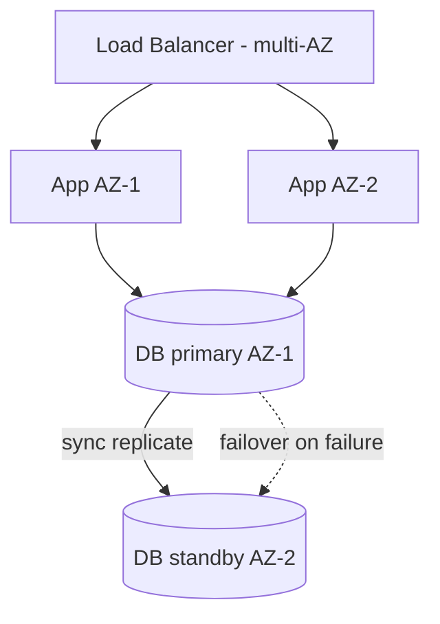

# High Availability

## Concept

- **High Availability (HA)** is designing a system to remain operational despite component failures, measured as **uptime** — often in "nines": 99.9% ("three nines") ≈ 8.7 hours downtime/year; 99.99% ≈ 52 min/year; 99.999% ≈ 5 min/year.
- The core principle is **eliminating single points of failure (SPOFs)** through **redundancy** and **automatic failover**: every critical component has a backup, and the system detects failures (heartbeats, Phase 4 topic 7) and routes around them without manual intervention.
- Key techniques:
  - **Redundancy across failure domains** — run across multiple **Availability Zones** (and regions, topic 20) so one data center failure doesn't take you down.
  - **Stateless, replicated app tier** behind a load balancer (Phase 3 topic 5) — any instance can fail.
  - **Database replication + failover** (Phase 3 topic 13) — standby replicas promote automatically.
  - **Health checks + auto-recovery** (autoscaling replaces dead instances, topic 24).
  - **Graceful degradation** — shed non-critical features rather than fail entirely (Phase 4 topics on bulkheads/circuit breakers).

## Problem It Solves

- Keeps services running through the **inevitable** failures — hardware dies, AZs go down, processes crash — so users experience continuous service instead of outages.
- Protects revenue and trust: downtime is directly costly, and SLAs commit to availability targets with penalties.
- Turns failures from outages into non-events by detecting and routing around them automatically.

## Trade-offs

- **More nines = exponentially more cost/complexity** — going from 99.9% to 99.99% to 99.999% requires multi-AZ, then multi-region, then sophisticated failover and testing — each step far more expensive. **Match the target to business need**, not "max nines."
- **Redundancy cost** — standbys and multi-AZ/region replication double (or more) infrastructure cost; the question is what downtime is actually worth avoiding.
- **Consistency vs. availability** — HA via replication runs into CAP (Phase 4); synchronous replication for no-data-loss failover costs latency, async risks losing recent writes.
- **Failover is itself risky** — automatic failover can misfire (split-brain, flapping); it must be tested (chaos engineering, topic 22) — untested failover often fails when needed.
- **The whole chain matters** — availability is limited by the *weakest* SPOF (a single LB, a single DNS, a single region); one un-redundant link caps the system.

## Examples

- **Multi-AZ web tier**
  - Stateless app instances across 3 AZs behind a multi-AZ load balancer; an AZ outage removes a third of capacity but the system stays up (with autoscaling replacing lost instances).
- **Database failover**
  - RDS multi-AZ keeps a synchronous standby in another AZ; primary failure triggers automatic promotion in ~1–2 minutes (Phase 3 topic 13).
- **Degradation over outage**
  - During a dependency failure, circuit breakers (Phase 3 topic 8) serve cached/default data so the core experience survives.
- **Calculating composite availability**
  - A request path through services each at 99.9% has *lower* combined availability (multiply); redundancy and decoupling (async, bulkheads) raise it.
- **Interview framing**
  - State an availability target tied to business need, then eliminate SPOFs with multi-AZ redundancy, stateless replicated tiers, DB replication + automatic failover, and health-check-driven recovery — plus graceful degradation. Noting that more nines cost exponentially more, and that failover must be tested, shows you balance reliability against cost rather than chasing nines.
