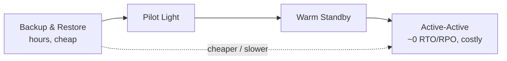

# Disaster Recovery

## Concept

- **Disaster Recovery (DR)** is the plan and capability to restore service after a **major failure** - a whole region outage, data-center loss, catastrophic data corruption, ransomware, or accidental mass-deletion - events bigger than the component failures HA (topic 10) handles.
- DR is defined by two target metrics that drive the whole strategy and its cost:
  - **RTO (Recovery Time Objective)**: how *fast* you must be back up (max tolerable downtime).
  - **RPO (Recovery Point Objective)**: how much *data loss* is tolerable (max age of the last recoverable backup).
- The standard strategies, from cheapest/slowest to costliest/fastest:
  - **Backup & Restore**: restore from backups into new infra. Hours+ RTO, hours RPO. Cheap.
  - **Pilot Light**: core (e.g., replicated DB) always running in the DR region; scale up the rest on disaster. Minutes - hours.
  - **Warm Standby**: a scaled-down full copy running; scale up on failover. Minutes.
  - **Hot / Multi-Site Active-Active**: full capacity running in multiple regions; near-zero RTO/RPO (topic 20). Most expensive.

## Problem It Solves

- Ensures the business survives **catastrophic** events, not just routine failures - a region going down, data being corrupted/encrypted/deleted, or a provider-wide incident.
- Forces explicit decisions (RTO/RPO) about how much downtime and data loss are acceptable, and provisions exactly enough recovery capability to meet them.
- Provides a tested, runbook-driven path to recovery so a disaster is a recoverable event, not an existential one.

## Trade-offs

- **RTO/RPO vs. cost**: lower RTO/RPO costs exponentially more (active-active is far pricier than backup-and-restore). Set targets by what downtime/data-loss actually costs the business, per system (a payments DB needs tighter RPO than an analytics store).
- **HA vs. DR are different**: HA handles component/AZ failures *within* a region automatically; DR handles *region-scale* disasters and often involves cross-region recovery. You need both; HA doesn't replace DR.
- **Backups must be tested & isolated**: untested backups routinely fail to restore; backups must be periodically restore-tested, and kept **immutable/offline** so ransomware can't encrypt them too.
- **Data corruption needs point-in-time recovery**: replication faithfully copies corruption/bad deletes to standbys; you need backups/PITR to recover to *before* the event, not just a replica.
- **Failover complexity**: cross-region failover (DNS, data, state) is intricate and must be rehearsed (game days) or it fails under pressure.

## Examples

- **RTO/RPO-driven choice**
  - A payments system requires RPO ≈ seconds and RTO ≈ minutes → warm standby or active-active with synchronous/continuous replication. An internal analytics tool tolerating a day of loss → nightly backup & restore.
- **Pilot light**
  - The production DB continuously replicates to a second region where minimal infra idles; on a regional disaster, IaC (topic 7) scales up the app tier there and traffic fails over.
- **Immutable backups vs. ransomware**
  - Backups are written to versioned, immutable object storage with separate credentials, so an attacker who compromises prod can't also destroy the backups.
- **Point-in-time recovery**
  - A bad migration corrupts data at 14:03; PITR restores the DB to 14:02, recovering correct state that replicas had already overwritten.
- **Interview framing**
  - Define DR by RTO/RPO and pick a strategy (backup-restore → pilot light → warm standby → active-active) matched to those targets and cost. Distinguishing DR from HA, insisting backups be tested and immutable, and noting point-in-time recovery for corruption are the marks of someone who's actually planned for disasters.
