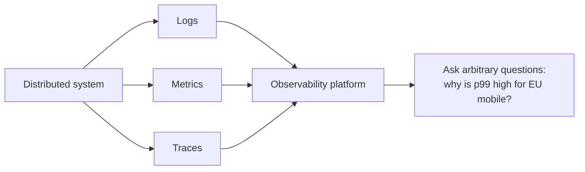

# Observability

## Concept

- **Observability** is the ability to understand a system's internal state from its external outputs — to answer **"why is it behaving this way?"**, including questions you didn't anticipate, without shipping new code to investigate.
- It's built on the **three pillars** (detailed in topic 13):
  - **Logs** — discrete, timestamped event records.
  - **Metrics** — numeric time-series aggregates (request rate, latency, error rate, saturation).
  - **Traces** — the path of a single request across services, with timing per hop.
- The distinction from classic **monitoring**: monitoring tells you *whether* something is wrong against **predefined** dashboards/alerts (known-unknowns); observability lets you **explore and ask new questions** to diagnose novel problems (unknown-unknowns) — essential in distributed systems where failure modes are unpredictable.
- A key enabler is **high-cardinality, structured** telemetry (rich context per event) so you can slice by user, region, version, endpoint, etc.

## Problem It Solves

- In a microservices/distributed system, a user-facing problem can originate anywhere across many services; observability lets you **find the root cause** by correlating logs, metrics, and traces — instead of guessing.
- Answers **novel** questions ("why are checkouts from this region on this app version slow?") that no pre-built dashboard anticipated.
- Reduces **MTTR (mean time to recovery)** during incidents and supports SLOs/error budgets (topic 21) with the data to measure them.

## Trade-offs

- **Insight vs. cost & volume** — telemetry (especially logs and traces) is expensive to collect, store, and query at scale; you must **sample** (traces), aggregate (metrics), and set retention — balancing fidelity against cost.
- **Cardinality cost** — high-cardinality dimensions enable powerful slicing but explode metric storage; choose dimensions deliberately.
- **Instrumentation effort** — good observability requires instrumenting code (spans, structured logs, metrics) and propagating context across services; under-instrumented systems are opaque. Standards like **OpenTelemetry** reduce lock-in and effort.
- **Noise vs. signal** — too much data or too many alerts overwhelm; the goal is *actionable* insight, not maximal data.
- **Three pillars in silos** — logs, metrics, and traces are most valuable **correlated** (jump from a metric spike to the traces to the logs); disconnected tools slow diagnosis.

## Examples

- **Correlated investigation**
  - An alert fires on elevated p99 latency (metric); you pivot to traces to find the slow service/span, then to that span's logs for the exact error — root cause in minutes.
- **High-cardinality slicing**
  - "Error rate by app version × region" reveals a bug isolated to one deployment in one region, enabling a targeted rollback.
- **OpenTelemetry**
  - Services emit OTel traces/metrics/logs with propagated trace context; a vendor-neutral backend (Grafana/Tempo, Honeycomb, Datadog) correlates them.
- **Monitoring vs. observability**
  - A dashboard shows CPU is fine (monitoring), yet users report slowness; exploratory querying of traces reveals a downstream dependency's tail latency — a question no dashboard pre-answered.
- **Interview framing**
  - For operating distributed systems, propose observability via the three correlated pillars (logs/metrics/traces) with structured, high-cardinality telemetry and OpenTelemetry instrumentation — and distinguish it from monitoring (known dashboards vs. exploring unknowns). Mentioning sampling/cardinality cost trade-offs and MTTR/SLO support shows production depth.
