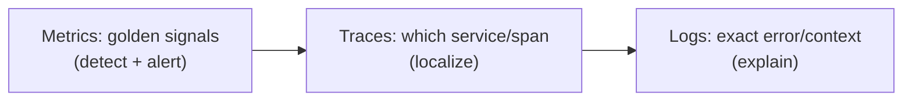

# Logging, Metrics, Tracing

## Concept

- The **three pillars of observability** (topic 12), each answering a different question:
  - **Logs** — *what happened?* Discrete, timestamped, often detailed event records. Best as **structured logs** (JSON with fields) so they're queryable, not just human text. Use for debugging specific events and errors.
  - **Metrics** — *how much / how often?* Numeric time-series, cheaply aggregated, ideal for dashboards and alerting. The canonical set is the **Four Golden Signals**: **latency, traffic, errors, saturation** (or RED: Rate, Errors, Duration; USE: Utilization, Saturation, Errors).
  - **Traces** — *where did the time go?* A **trace** follows one request across all services it touches, composed of **spans** (one unit of work each) with timing and parent/child relationships, tied together by a propagated **trace ID**.
- They're complementary: metrics detect a problem and alert, traces localize *where*, logs explain *why*. Correlating them (shared trace/request IDs) is what makes diagnosis fast.

## Problem It Solves

- Together they provide both the **broad health view** (metrics on dashboards, alerting on golden signals) and the **deep diagnostic detail** (traces to localize, logs to explain) needed to operate and debug distributed systems.
- **Tracing** specifically solves the microservices problem: a slow request crosses many services, and only a distributed trace shows *which hop* caused the latency.
- Enables alerting, SLO measurement (topic 21), capacity insight, and post-incident analysis.

## Trade-offs

- **Logs: detail vs. cost/volume** — logs are the richest but most voluminous and expensive pillar; high-volume debug logging is costly to store/search. Use levels, structure them, and sample/retain deliberately.
- **Metrics: cheap but low-detail + cardinality limits** — metrics are cheap and great for trends/alerts but lose per-event detail; high-cardinality labels (user_id) blow up storage. Use bounded labels.
- **Traces: powerful but sampled** — tracing every request is expensive, so most systems **sample** (head-based or tail-based, the latter keeping interesting/slow/error traces). Sampling means you might miss a specific request's trace.
- **Instrumentation & context propagation** — traces require propagating context across every service/async boundary; gaps break the trace. Standardize with OpenTelemetry.
- **Right pillar for the job** — using logs for what should be a metric (counting via log scans) is slow and costly; using metrics where you need per-event detail loses information.

## Examples

- **Golden-signal alerting**
  - Alert on error rate > 1% or p99 latency > SLO for 5 min (metrics) — cheap, fast detection feeding error budgets (topic 21).
- **Trace a slow request**
  - A trace shows the request spent 800ms in the inventory service's DB span — instantly localizing the bottleneck across 6 services.
- **Structured logs**
  - Logs as JSON (`{"level":"error","trace_id":"abc","user":42,"msg":"payment declined"}`) are queried by `trace_id` to see everything about one request.
- **Tail-based sampling**
  - Keep 100% of error/slow traces and 1% of normal ones — capturing the interesting cases without storing everything.
- **Interview framing**
  - Map each pillar to its question and cost: metrics (golden signals) for alerting/dashboards, traces for localizing latency across services, structured logs for root-cause detail — all correlated by trace/request IDs via OpenTelemetry. Mentioning trace sampling and log volume as the cost levers, and the golden signals as what to alert on, is exactly the operational depth expected.
