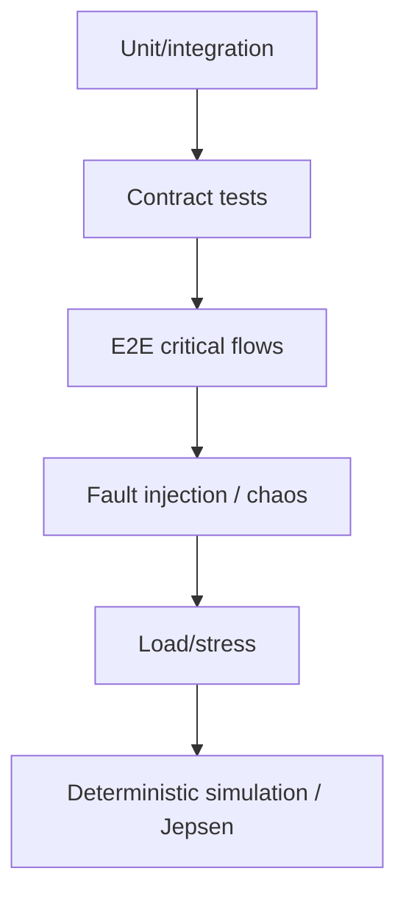

# Testing Distributed Systems

## Concept

- Distributed systems fail in ways unit tests never reach: network partitions, partial failures, message reordering/duplication, clock skew, slow nodes, and emergent behavior under load. **Testing distributed systems** is the set of techniques for gaining confidence in these conditions.
- The layered approach:
  - **Unit & integration tests** — logic and service-pair interactions (with mocked/real dependencies).
  - **Contract testing** — verify that a service and its consumers agree on the API contract (consumer-driven contracts, e.g., Pact) so independently-deployed services don't break each other.
  - **End-to-end tests** — full critical flows across real services (few, focused — they're slow/flaky).
  - **Fault injection / chaos testing** — deliberately inject failures (kill nodes, add latency, drop packets) to verify resilience (chaos engineering, topic 22).
  - **Load & stress testing** — behavior under expected and breaking-point load (topic 23).
  - **Deterministic simulation testing** — run the whole system in a simulated, controlled-time environment to reproduce rare concurrency/ordering bugs (e.g., FoundationDB's approach, Jepsen for consistency).

## Problem It Solves

- Catches **distributed-specific bugs** — race conditions, partition behavior, retry/idempotency errors, consistency violations — that pass every unit test but cause production outages.
- **Contract tests** let many teams deploy independently (microservices) without integration breakages, replacing brittle full-environment E2E for API compatibility.
- **Chaos and load testing** validate that resilience patterns (circuit breakers, retries, bulkheads, failover) actually work *before* real incidents test them.
- **Jepsen-style testing** verifies a datastore's claimed consistency guarantees actually hold under partitions.

## Trade-offs

- **Realism vs. speed/stability** — E2E and full-environment tests are realistic but slow, flaky, and expensive; over-relying on them yields an unreliable suite. Push coverage down to contract and integration tests where possible.
- **Contract tests vs. coverage** — contract testing is efficient for API compatibility but doesn't test end-to-end behavior; it complements, not replaces, some integration testing.
- **Chaos in prod vs. staging** — chaos experiments are most valuable in production (real conditions) but riskiest there; start in staging, then production with small blast radius and guardrails (topic 22).
- **Determinism is hard to build** — deterministic simulation testing catches deep bugs but requires architecting the system for it (controlled time, injected I/O) — a major investment few systems make.
- **Can't test everything** — distributed state spaces are effectively infinite; testing reduces risk, it doesn't prove correctness.

## Examples

- **Consumer-driven contract**
  - The web team's expectations of the orders API are encoded as a Pact contract; the orders service's CI verifies it, so an incompatible change fails *before* deploy — independent deploys stay safe.
- **Jepsen consistency test**
  - A database's "linearizable" claim is tested by injecting partitions while clients read/write, checking for consistency violations — famously finding real bugs in many databases.
- **Chaos game day**
  - The team kills a primary DB in staging to verify automatic failover and that the app degrades gracefully, then repeats in prod with a small blast radius (topic 22).
- **Idempotency under redelivery**
  - A test forces duplicate message delivery to verify consumers are idempotent (Phase 3 topic 22) and produce no double effects.
- **Interview framing**
  - For testing a distributed system, describe the layered approach: unit/integration, **contract tests** for independent deploys, focused E2E, **fault injection/chaos** to validate resilience, and load testing — plus Jepsen-style checks for datastore consistency. Emphasizing that distributed bugs (partitions, ordering, partial failure) need *deliberate* failure testing, not just happy-path tests, is the senior insight.
