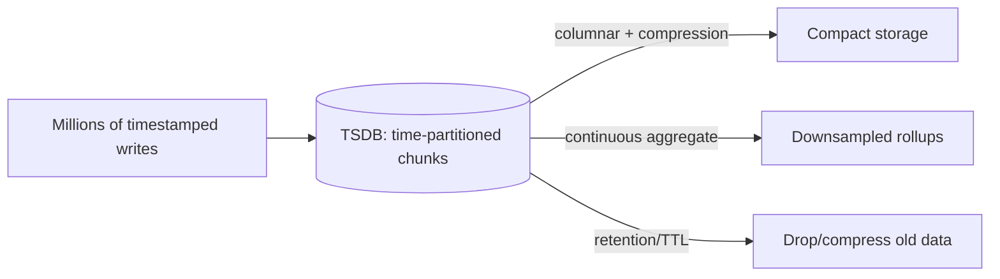

# Time-Series Databases

## Concept

- A **time-series database (TSDB)** is purpose-built for data that is **timestamped, append-heavy, and queried by time ranges** — metrics, monitoring data, IoT sensor readings, financial ticks, event telemetry.
- Time-series workloads have a distinctive shape: enormous, continuous **append-only writes** (millions/sec), almost never updates, reads that are **range scans over time** with **aggregation** (avg/max per 5-minute bucket), and data whose value **decays with age** (raw recent data matters; old data is downsampled).
- TSDBs optimize for this with: time-based partitioning (chunks), **columnar storage + heavy compression** (sequential similar values compress extremely well — often 90%+), **downsampling/rollups** (continuous aggregates), and **retention/TTL** policies that auto-drop or compress old data.
- (Architecturally this is a *data/storage* topic; it lives in this phase but pairs naturally with the data cluster in Phase 3.)

## Problem It Solves

- A general-purpose B-tree database struggles with time-series at scale: millions of tiny inserts/sec thrash B-tree indexes (page splits), and storing/raw-querying huge volumes is expensive. TSDBs handle the **write volume**, **compression**, and **time-range aggregation** that general databases can't economically.
- **Downsampling + retention** keep storage bounded and queries fast: keep raw data for days, hourly rollups for months, daily for years.
- Powers monitoring/observability backends (topics 12–13), IoT platforms, and analytics dashboards over time.

## Trade-offs

- **Specialized vs. general** — TSDBs are excellent for append-heavy, time-ranged, aggregate workloads but poor for general OLTP (updates, joins, arbitrary queries); they're a complement, not a replacement for your primary DB.
- **Write-optimized via LSM-style storage** — high ingest comes from append-oriented storage (Phase 3 topic 30), with the read/compaction trade-offs that implies.
- **Cardinality explosion** — high-cardinality tag/label combinations (e.g., per-user, per-request-ID series) blow up index size and degrade performance — the #1 TSDB scaling pitfall (especially Prometheus). Keep label cardinality bounded.
- **Downsampling loses detail** — rollups save space but discard granularity; you must choose retention tiers deliberately (you can't recover raw data you downsampled away).
- **Eventual/approximate** — some TSDBs trade exactness for ingest speed.

## Examples

- **Monitoring stack**
  - **Prometheus** scrapes and stores metrics for alerting/dashboards (Grafana); its label model is powerful but cardinality-sensitive — the backend behind golden-signal alerting (topic 13).
- **TimescaleDB**
  - PostgreSQL extension adding automatic time-partitioning (hypertables), columnar compression, and continuous aggregates — full SQL + time-series performance (good when you want SQL and Postgres ecosystem).
- **InfluxDB**
  - Purpose-built TSDB with a line-protocol ingest, high write throughput, and retention policies — common for IoT/metrics.
- **Retention tiers**
  - Raw 1s data kept 7 days, 1-minute rollups 90 days, 1-hour rollups 2 years — automatically, bounding cost.
- **Interview framing**
  - When a design ingests metrics/IoT/telemetry at high volume with time-range, aggregate queries, propose a TSDB (Prometheus/Timescale/Influx) and explain *why*: append-optimized storage, columnar compression, downsampling + retention. Flagging **cardinality** as the key scaling risk is the detail that shows real experience.
