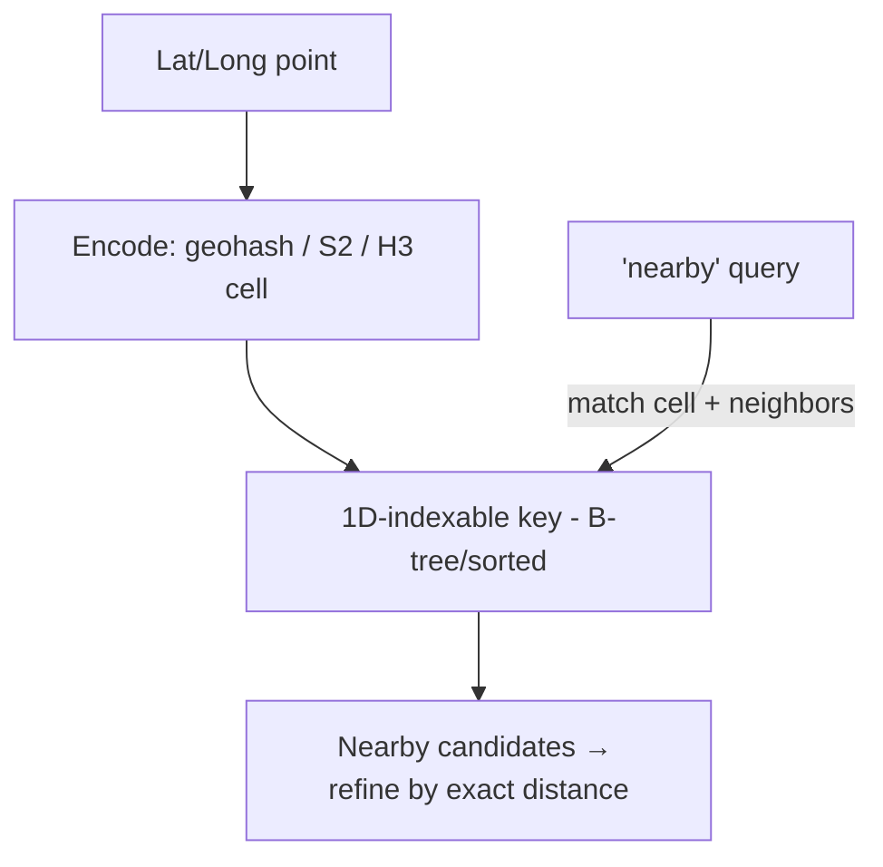

# Geospatial Indexing

## Concept

- **Geospatial indexing** makes **location-based queries** efficient - "find the N nearest drivers," "all restaurants within 2km," "who's inside this delivery zone." A normal B-tree index can't do this well because proximity is **two-dimensional**; you can't sort 2D points on a single axis and preserve nearness.
- The core idea is to **map 2D space to a 1D, locality-preserving key** (so nearby points get nearby keys, indexable by a normal B-tree), or to use a spatial tree:
  - **Geohash**: encodes lat/long into a short string where shared prefixes mean spatial proximity (a grid of nested cells). Great for proximity via prefix matching.
  - **Quadtree**: recursively subdivides space into four quadrants; adapts to density.
  - **R-tree**: bounding-box tree for shapes/regions (PostGIS uses this).
  - **S2 (Google) / H3 (Uber)**: hierarchical cell systems (S2 maps the sphere to cells; H3 uses hexagons) that handle the globe and avoid grid edge-distortion better than naive geohash.

## Problem It Solves

- Turns "find things near a point" from an O(N) scan of all locations (computing distance to every one) into an efficient indexed lookup of a small candidate set - essential for ride-sharing, food delivery, maps, "nearby" features, and geofencing at scale.
- Handles **proximity and region** queries (radius search, k-nearest, point-in-polygon) that relational indexes can't.
- Enables sharding/partitioning by region for locality (drivers in a city colocated).

## Trade-offs

- **Cell size / precision**: coarse cells return too many candidates (more filtering); fine cells require checking many neighboring cells for a radius query. Choosing precision per query is a real tuning concern.
- **Edge/boundary problem**: a point near a cell boundary has nearby points in *adjacent* cells, so proximity queries must search the cell **plus its neighbors** and then refine by exact distance - geohash especially suffers at boundaries (S2/H3 mitigate but don't eliminate).
- **Approximate then exact**: spatial indexes give a candidate set fast; you still compute exact distances to rank/filter - a two-step pattern.
- **Hotspots**: dense areas (a city center) concentrate points in few cells → hot partitions (Phase 3 topic 32); H3's uniform hexagons help, but density skew is inherent.
- **Moving points**: frequently-updating locations (live drivers) stress the index with constant updates; often handled with an in-memory geo-index (Redis GEO / a QuadTree in memory) rather than a disk DB.

## Examples

- **Nearby drivers (ride-sharing)**
  - Driver locations indexed by S2/H3 cell (often in Redis or an in-memory quadtree); a rider's request looks up the rider's cell + neighbors, gets candidate drivers, then ranks by exact distance/ETA - the core of the ride-sharing case study.
- **Redis GEO**
  - `GEOADD`/`GEOSEARCH` provide geohash-backed radius and nearest queries in memory - great for fast, moving-point proximity.
- **PostGIS**
  - PostgreSQL + PostGIS uses R-tree (GiST) indexes for rich spatial queries (radius, polygons, distance) with full SQL - good for restaurants/places.
- **Geofencing**
  - H3 cells determine whether a delivery point falls inside a zone polygon efficiently.
- **Interview framing**
  - For any "nearby / within radius / nearest" feature (ride-sharing, delivery, maps), propose a geospatial index (geohash/S2/H3 or PostGIS R-tree), explain the map-2D-to-1D-cell idea, and address the **boundary problem** (search neighbor cells + refine by exact distance) and density hotspots. Mentioning Redis GEO/in-memory for fast-moving points shows you match the tool to the access pattern.
