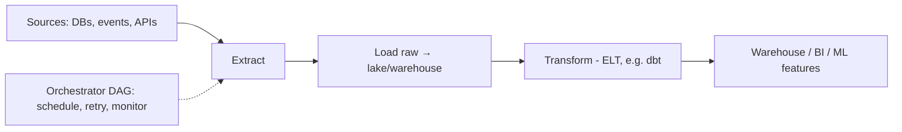

# Data Pipelines

## Concept

- A **data pipeline** moves and transforms data from sources (databases, events, APIs, files) to destinations (warehouses, lakes, search indexes, ML feature stores) where it can be analyzed or served. It's the plumbing that turns raw operational data into usable derived data.
- Two fundamental processing modes:
  - **Batch**: process large volumes on a schedule (hourly/nightly). High throughput, higher latency. Tools: Spark, traditional ETL, Airflow-orchestrated jobs.
  - **Streaming**: process events continuously in near-real-time (Phase 4 topic 24). Low latency, more complex (windowing, late data). Tools: Flink, Kafka Streams, Spark Structured Streaming.
- The transformation shape:
  - **ETL**: Extract, **Transform**, then Load (transform before loading into the warehouse).
  - **ELT**: Extract, Load raw, then **Transform** inside the warehouse (modern, leverages cheap warehouse compute; dbt popularized it).
- Pipelines are **orchestrated** as DAGs (directed acyclic graphs of dependent tasks) with scheduling, retries, and monitoring (Airflow, Dagster, Prefect).

## Problem It Solves

- Gets data **out of operational systems** (where running heavy analytics would hurt production) and into analytics-optimized stores, transformed into clean, modeled, queryable shapes.
- Powers analytics, BI dashboards, reporting, and ML training/features from a consistent, governed data layer.
- **Decouples** producers from consumers of data and provides reliability (retries, backfills, idempotent reprocessing) around inherently messy, large-scale data movement.
- (This is the anchor topic of data engineering; CDC, stream processing, warehouses/lakes, and ETL-vs-ELT are its neighbors - see Phase 4 topics 24-25 and the broader data-engineering material.)

## Trade-offs

- **Batch vs. streaming**: batch is simpler, cheaper, and fine when hourly/daily latency suffices; streaming gives freshness but adds complexity (state, late/out-of-order data, exactly-once). Don't pay for streaming if batch meets the SLA (the Lambda vs. Kappa architecture debate).
- **ETL vs. ELT**: ELT (load raw, transform in-warehouse) is flexible and leverages cheap scalable warehouse compute, but loads raw (possibly sensitive) data first and can run up warehouse costs; ETL transforms first (less raw storage, more rigid). ELT is the modern default for cloud warehouses.
- **Reliability & idempotency**: pipelines fail (bad data, source outages); they must support **backfills** and **idempotent reprocessing** without duplicating or corrupting downstream data.
- **Data quality**: garbage in, garbage out; pipelines need validation, schema checks, and monitoring or they silently propagate bad data (data governance).
- **Orchestration complexity**: large DAGs with many dependencies are operationally heavy; needs good observability and alerting on failures/SLAs.

## Examples

- **Modern ELT stack**
  - Fivetran/Airbyte or CDC (Phase 4 topic 25) extracts and loads raw data into Snowflake/BigQuery; **dbt** transforms it into modeled tables; Airflow/Dagster orchestrates; BI tools query the result.
- **Streaming pipeline**
  - Kafka → Flink computes real-time aggregates (windowed, topic 24) → served to a dashboard and a feature store, with batch reprocessing for corrections.
- **Idempotent backfill**
  - A bug corrupted yesterday's output; the pipeline re-runs that partition idempotently (overwriting, not appending) to fix it without duplicates.
- **Lambda architecture**
  - A streaming layer gives fast approximate results; a nightly batch layer recomputes exact results - combining freshness and correctness.
- **Interview framing**
  - For analytics/ML data needs, propose a pipeline and choose batch vs. streaming by the freshness SLA, and ETL vs. ELT (favoring ELT + dbt for cloud warehouses). Stressing orchestration (DAGs), idempotent backfills, and data-quality checks shows you understand pipelines as reliability-critical systems, not one-off scripts.
