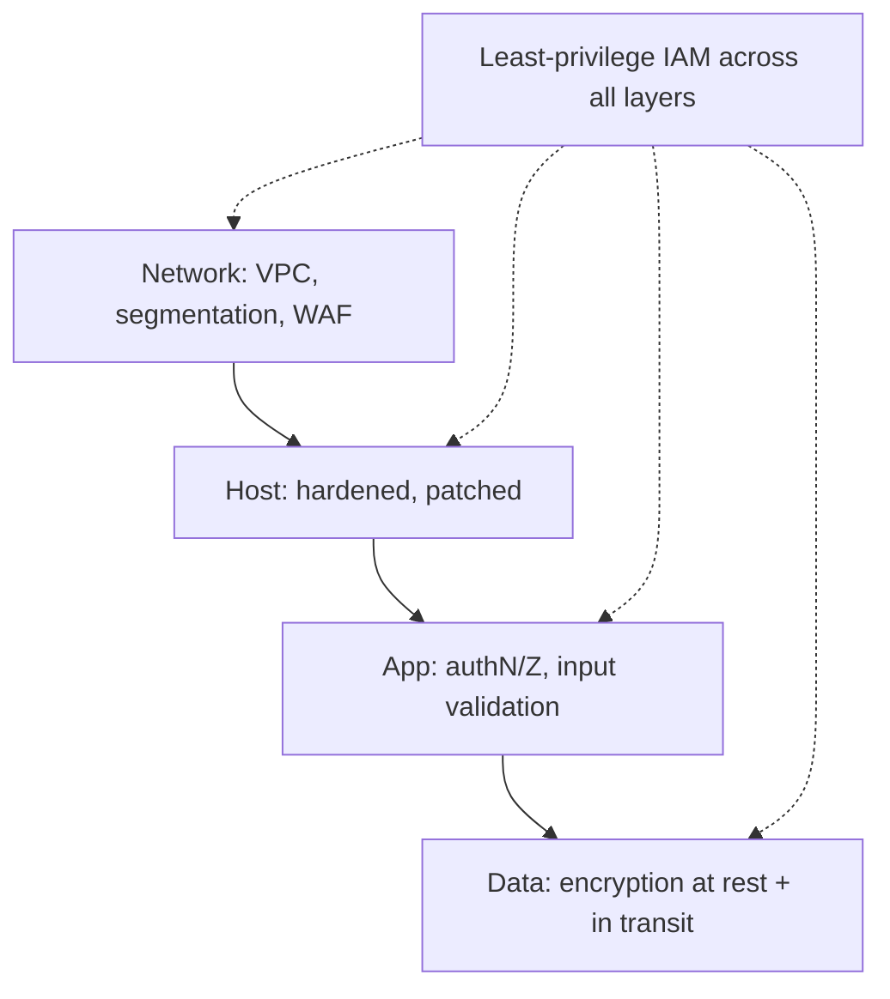

# Security Architecture

## Concept

- **Security architecture** is the system-level design of how an application protects confidentiality, integrity, and availability - the structural defenses, not just individual bug fixes. (This is the overview; specific disciplines - threat modeling, OWASP, zero trust, identity federation, secrets, supply chain, security monitoring - are deepened in the Security phase.)
- The guiding principles:
  - **Defense in depth**: multiple independent layers (network, host, app, data) so one failure isn't catastrophic.
  - **Least privilege**: every user, service, and credential gets the minimum access needed (IAM roles scoped tightly).
  - **Zero trust**: never trust based on network location; authenticate and authorize every request (verify explicitly).
  - **Secure by default**: safe defaults, fail closed, encrypt by default.
  - **Encryption**: **in transit** (TLS everywhere) and **at rest** (disk/DB/object encryption with managed keys).
  - **Minimize attack surface**: fewer exposed endpoints, ports, and privileges.

## Problem It Solves

- Provides a **structured, layered** defense so a single vulnerability (one XSS, one leaked credential, one open port) doesn't lead to full compromise - containing breaches and limiting blast radius.
- Bakes security into the architecture rather than bolting it on, addressing confidentiality (no data leaks), integrity (no tampering), and availability (resist DoS) by design.
- Establishes the controls auditors and compliance regimes (SOC 2, PCI, HIPAA, GDPR) require.

## Trade-offs

- **Security vs. usability/velocity**: strong controls (MFA, least-privilege approvals, strict network rules) add friction for users and developers; the art is securing without grinding productivity to a halt (good platform tooling helps).
- **Defense-in-depth cost**: more layers mean more components to build, operate, and monitor; over-engineering security for a low-risk system wastes effort, under-doing it for a high-risk one is negligent. Match controls to the threat model and data sensitivity.
- **Encryption key management**: encryption is easy; **key management** (rotation, access, recovery) is the hard part - a lost key loses data, a leaked key defeats the encryption (managed KMS helps).
- **Least privilege vs. operational friction**: tight IAM is safest but can slow legitimate work; needs good role design and just-in-time access rather than blanket admin.
- **Shared responsibility**: in the cloud, the provider secures infrastructure; *you* secure configuration, identity, and data - misconfiguration (open buckets, over-broad IAM) is the leading breach cause.

## Examples

- **Layered web app**
  - WAF + network segmentation (topic 9) → TLS termination → app with input validation and authN/Z → database encrypted at rest with KMS-managed keys, reachable only from the app tier - defense in depth.
- **Least-privilege IAM**
  - Each service has a role granting only the specific resources it needs; no shared admin credentials; human access is just-in-time and audited.
- **Encryption everywhere**
  - TLS 1.3 for all traffic (including service-to-service via mTLS/mesh, Phase 3 topic 4); databases, disks, and object storage encrypted at rest; secrets in a vault (secrets management).
- **Secure defaults**
  - New resources default to private, deny-by-default firewall rules, and mandatory MFA - safe unless explicitly opened.
- **Interview framing**
  - For security architecture, lead with principles - defense in depth, least privilege, zero trust, encryption in transit + at rest, secure defaults - and apply them per layer (network/host/app/data). Noting the security-vs-usability balance, key management as the hard part, and cloud shared-responsibility/misconfiguration risk shows architectural security maturity. (Deeper topics: threat modeling, OWASP, zero trust, supply chain - see the Security phase.)
