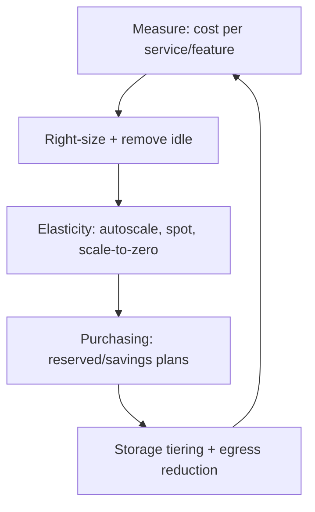

# Cost Optimization

## Concept

- **Cost optimization** (a core part of **FinOps**) is engineering and operating cloud systems to deliver the required performance and reliability at the **lowest sustainable cost** - treating cost as a first-class design constraint, not an afterthought on the bill.
- The major levers:
  - **Right-sizing**: match instance/resource sizes to actual usage; eliminate over-provisioning (most cloud waste).
  - **Elasticity**: autoscale (topic 24) and scale-to-zero (serverless, topic 3) so you pay for load, not peak-always-on capacity.
  - **Purchasing models**: on-demand vs. **Reserved/Savings Plans** (commit for big discounts on steady workloads) vs. **Spot** (cheap, interruptible, for fault-tolerant batch).
  - **Storage tiering**: move cold data to cheaper tiers (Phase 3 topic 34); lifecycle policies.
  - **Egress & data transfer**: often a hidden, large cost (cross-region, cross-AZ, internet egress); architect to minimize it (CDN, locality).
  - **Managed-service vs. self-host** trade-offs, and turning off idle/unused resources.

## Problem It Solves

- Cloud's pay-per-use, easy-provisioning model makes costs **silently balloon** (idle resources, over-provisioning, runaway egress, unbounded data growth); cost optimization keeps spend aligned with value and prevents budget surprises.
- Frees budget for product work and improves margins; at scale, infrastructure cost is a major business lever.
- Creates accountability - attributing cost to teams/features so engineers see and own the financial impact of their designs.

## Trade-offs

- **Cost vs. performance/reliability/velocity**: the cheapest option often sacrifices latency, availability, or engineering speed; optimize for **cost-efficiency** (value per dollar), not minimum cost. Over-optimizing (e.g., all-spot for critical workloads) causes outages.
- **Reserved commitments vs. flexibility**: reservations/savings plans cut cost for predictable workloads but lock you in; over-committing wastes money if usage changes.
- **Spot savings vs. interruption**: spot is very cheap but can be reclaimed anytime; only for interruption-tolerant, checkpointable work (batch, stateless), not critical stateful services.
- **Optimization effort vs. savings**: engineering time spent optimizing has a cost; focus on the biggest line items (the 80/20), not micro-savings.
- **Managed vs. self-host**: managed services cost more per unit but save operational headcount; the true comparison includes engineering time, not just the cloud bill.

## Examples

- **Right-sizing + autoscaling**
  - Over-provisioned instances at 15% CPU are downsized and put behind an autoscaler that scales with load, cutting compute cost substantially without hurting performance.
- **Spot for batch**
  - ML training or data-pipeline jobs run on spot instances at ~70% discount, checkpointing so interruptions just resume.
- **Reserved for baseline**
  - The steady baseline capacity is covered by 1-3 year savings plans (big discount); bursts use on-demand/spot.
- **Egress reduction**
  - Serving assets via CDN (cached at edge) and keeping chatty services in the same AZ slashes data-transfer charges - often a top-3 cost line.
- **Cost visibility**
  - Tagging resources by team/feature and dashboards showing cost-per-service make waste visible and create ownership (FinOps).
- **Interview framing**
  - When cost comes up, frame it as cost-*efficiency*: right-size, use elasticity (autoscale/spot/serverless), buy reserved for steady load, tier storage, and cut egress - while protecting performance/reliability. Calling out egress as a hidden cost and spot-only-for-fault-tolerant-work shows real cloud cost experience.
