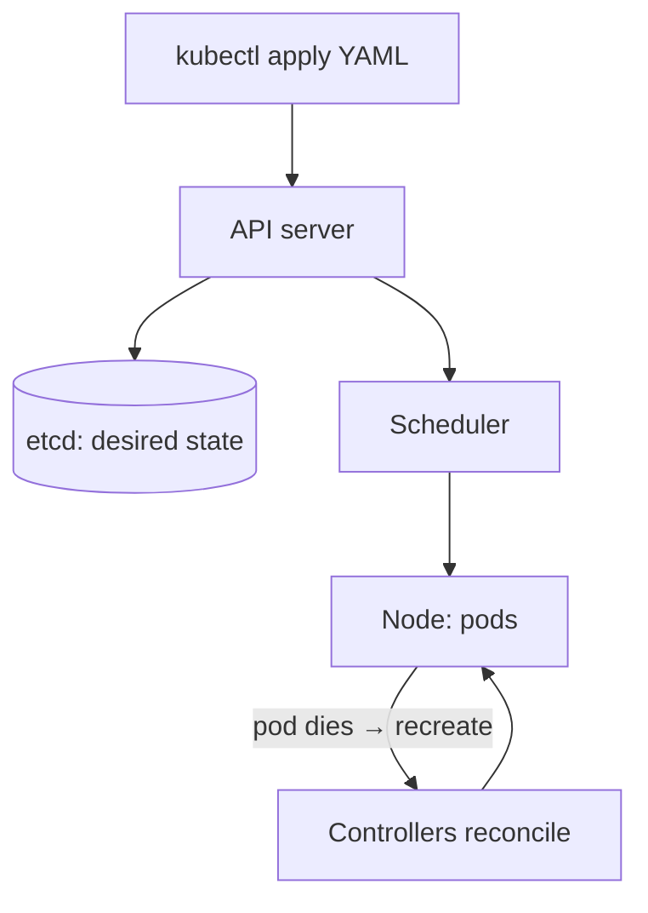

# Kubernetes

## Concept

- **Kubernetes (K8s)** is a container **orchestration** platform: it runs, schedules, scales, heals, and networks containers across a cluster of machines, turning a fleet of servers into one logical platform.
- Its model is **declarative**: you describe the desired state (e.g., "run 5 replicas of this image, expose it, keep it healthy") in YAML, and Kubernetes' **control loops** continuously reconcile reality toward that state — restarting crashed containers, rescheduling off dead nodes, and maintaining replica counts.
- Core objects:
  - **Pod** — the smallest unit: one or more containers sharing network/storage.
  - **Deployment** — manages a replicated, self-healing set of pods with rolling updates.
  - **Service** — stable virtual IP/DNS for a set of pods (built-in service discovery + load balancing, Phase 4 topic 15).
  - **Ingress** — HTTP routing from outside into services.
  - **ConfigMap/Secret** — configuration and secrets.
  - **HPA** — autoscaler that adjusts replicas based on load (topic 24).
- The control plane (API server, scheduler, controller manager, **etcd** — the consensus-backed state store, Phase 4 topic 16) manages worker nodes running a kubelet + container runtime.

## Problem It Solves

- **Self-healing & automation** — keeps the desired number of healthy pods running, reschedules off failed nodes, and restarts crashed containers — operational toil that's otherwise manual.
- **Scaling** — horizontal scaling (manual or autoscaled, topic 24) and bin-packing many workloads efficiently across nodes.
- **Zero-downtime deploys** — rolling updates and rollbacks built in.
- **Service discovery & networking** — built-in DNS, load balancing, and ingress (Phase 4 topic 15).
- **Portability** — a consistent platform across clouds and on-prem, the de facto standard for running containers at scale.

## Trade-offs

- **Power vs. enormous complexity** — Kubernetes is a complex distributed system with a steep learning curve and significant operational burden; it's frequently **over-engineering** for small apps. A managed PaaS, serverless (topic 3), or a few VMs is often the right call until scale/needs justify K8s.
- **Managed vs. self-hosted** — managed control planes (EKS/GKE/AKS) remove much of the operational pain; self-hosting is a major undertaking.
- **Cost & resource overhead** — the control plane and per-node agents add overhead; idle clusters waste money (mitigate with autoscaling, topic 24).
- **YAML sprawl & config drift** — large clusters accumulate hard-to-manage manifests; tooling (Helm, Kustomize, GitOps/ArgoCD) and an internal platform (topic 27) tame this.
- **Stateful workloads are harder** — databases on K8s (StatefulSets, persistent volumes) are possible but operationally tricky; managed data services are often preferred.

## Examples

- **Deployment + Service + HPA**
  - A Deployment runs 5 replicas; a Service gives a stable DNS name and load-balances; an HPA scales replicas 5→50 when CPU exceeds target (topic 24) — declared in YAML, reconciled automatically.
- **Rolling update**
  - `kubectl set image` triggers a rolling update: new pods come up healthy before old ones drain, with automatic rollback on failure.
- **Self-healing**
  - A node crashes; its pods are rescheduled onto healthy nodes and the Service routes around the failure — no human intervention.
- **GitOps**
  - ArgoCD watches a Git repo of manifests and reconciles the cluster to match — Git is the source of truth, deploys are PRs.
- **Interview framing**
  - Reach for Kubernetes when you have many containerized services needing orchestration, scaling, and self-healing at scale — and explicitly note it's overkill for small workloads (prefer serverless/PaaS there). Mentioning managed control planes, autoscaling, and GitOps shows you weigh its operational cost, not just its power.
