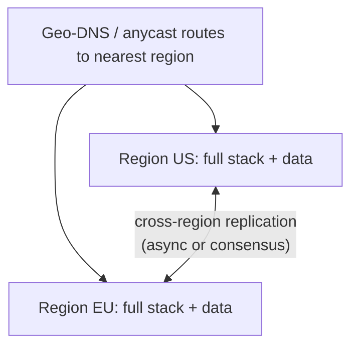

# Multi-Region Design

## Concept

- **Multi-region design** runs a system across multiple geographic cloud regions for **low global latency**, **disaster resilience** (survive a whole region failure), and sometimes **data residency** compliance. It's the highest tier of availability and the hardest distributed-systems problem in practice.
- The deployment models:
  - **Active-Passive (failover)**: one region serves; another is a standby that takes over on disaster (warm standby, topic 11). Simpler; some failover time/data loss.
  - **Active-Active**: multiple regions serve traffic simultaneously, users routed to the nearest (geo-DNS/anycast). Lowest latency and best availability, but requires solving **multi-region data consistency** - the crux.
- The fundamental challenge is **data**: replicating state across regions means cross-region latency (50-150ms+) and CAP/PACELC trade-offs (Phase 4). You must choose per-data-type between strong consistency (slow cross-region coordination) and eventual consistency (fast, but conflicts).

## Problem It Solves

- **Global low latency**: serving users from a nearby region beats cross-continent round trips, critical for global products.
- **Regional disaster survival**: an entire region outage (rare but real) doesn't take the system down; another region serves (the strongest DR, topic 11).
- **Data residency / sovereignty**: keep certain users' data in-region for legal compliance (GDPR, etc.).
- **Highest availability**: beyond multi-AZ (topic 10), multi-region removes the region as a single point of failure.

## Trade-offs

- **Active-active power vs. data consistency hell**: serving writes in multiple regions means conflicting concurrent writes and cross-region replication lag; you must pick a strategy per data type: single-writer-region (route writes to a home region), CRDTs/eventual consistency (Phase 4 topic 14) for mergeable data, or a globally-consistent database (Spanner/CockroachDB) at high latency/cost. There is no free lunch - this is the core difficulty.
- **Latency vs. consistency (PACELC)**: strong global consistency requires cross-region coordination on every write (slow); eventual consistency is fast but exposes stale reads/conflicts.
- **Cost**: running full stacks + data in multiple regions multiplies infrastructure cost and cross-region data-transfer (egress) charges (topic 19).
- **Operational complexity**: deploys, schema migrations, failover, and observability across regions are far harder; testing region failover (chaos, topic 22) is essential and often neglected.
- **Most systems don't need it**: multi-AZ within one region (topic 10) covers the vast majority of availability needs; go multi-region only for genuine global-latency, region-DR, or residency requirements.

## Examples

- **Single-writer-region (active-active reads)**
  - Each user has a "home region" that owns their writes (avoiding write conflicts); all regions serve reads from local replicas; cross-region replication is async - low-latency local reads, conflict-free writes.
- **Globally-consistent DB**
  - Spanner/CockroachDB provide multi-region ACID via consensus + synchronized clocks - strong consistency globally, at higher write latency (PACELC EC).
- **Eventual consistency for mergeable data**
  - Shopping carts/counters use CRDTs (Phase 4 topic 14) so concurrent multi-region writes merge without coordination.
- **Active-passive DR**
  - A primary region serves; a warm standby in another region (continuous replication) fails over on regional disaster with bounded RPO/RTO (topic 11).
- **Interview framing**
  - Reach for multi-region only when global latency, region-level DR, or data residency genuinely require it (multi-AZ suffices otherwise). Then make the **data consistency** decision explicit per data type - single-writer-region, CRDTs/eventual, or a global consensus DB - and acknowledge the latency, cost, and operational complexity. Leading with the data problem (not just "deploy to two regions") is the senior/Staff signal.
