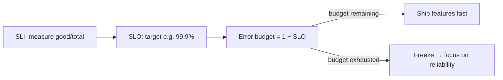

# SLOs, SLIs & Error Budgets

## Concept

- This is the vocabulary of **reliability engineering** (SRE) — how you define, measure, and make decisions about reliability with data instead of vibes.
  - **SLI (Service Level Indicator)** — a *measurement* of some aspect of service quality, expressed as a ratio of good events to total. E.g., "proportion of requests served < 300ms" or "proportion of requests returning non-5xx."
  - **SLO (Service Level Objective)** — a *target* for an SLI over a window. E.g., "99.9% of requests succeed over 30 days." The internal reliability goal.
  - **SLA (Service Level Agreement)** — a *contractual* promise to customers (with penalties), usually looser than the internal SLO.
  - **Error budget** — the *allowed unreliability* = `100% − SLO`. A 99.9% SLO permits 0.1% failures (~43 min/month). This budget is a **resource you spend**.

## Problem It Solves

- Replaces vague "the system should be reliable" with **measurable targets** and turns reliability into an **objective, data-driven decision tool**.
- The **error budget** resolves the eternal dev-vs-ops tension between shipping features (risky) and stability: if you're within budget, ship aggressively; if you've burned it (too many incidents), **freeze features and fix reliability**. It's a shared, quantified contract between teams.
- Aligns reliability investment with actual need — you stop over-engineering past the SLO (100% is the wrong target) and under-investing below it.

## Trade-offs

- **Choosing good SLIs is hard** — the SLI must reflect *user-perceived* reliability (e.g., measured at the load balancer / from the user's side), not a vanity internal metric. Bad SLIs give false confidence.
- **SLO target setting** — too strict wastes effort and blocks shipping; too loose lets real pain through. Base it on user expectations and what the business needs, not "as high as possible."
- **100% is the wrong goal** — chasing 100% reliability is infinitely expensive and stops all change; the error budget *deliberately* permits failure so you can move fast. This is counterintuitive to many.
- **Error-budget policy needs teeth** — the "freeze features when budget is gone" rule only works if leadership actually enforces it; otherwise SLOs are decorative.
- **Measurement & windows** — rolling vs. calendar windows, burn-rate alerting (fast-burn vs. slow-burn), and what counts as "good" all need care.

## Examples

- **Availability SLO**
  - SLI = (non-5xx requests / total requests) measured at the LB; SLO = 99.9% over 28 days; error budget = 0.1% (~40 min/month). Burn-rate alerts fire when the budget is being consumed too fast.
- **Latency SLO**
  - SLI = (requests < 300ms / total); SLO = 99% — capturing user-perceived speed, not just average latency.
- **Error-budget decision**
  - A series of incidents burns the month's budget; per policy, the team pauses risky feature launches and spends the next cycle on reliability fixes — an objective, pre-agreed trigger.
- **Budget remaining → ship fast**
  - Plenty of budget left and stable → the team ships experiments and risky changes confidently, "spending" budget intentionally.
- **Interview framing**
  - When reliability or "how reliable should it be" comes up, define SLI/SLO/error budget precisely and use the error budget as the mechanism balancing feature velocity vs. stability. Stressing that the SLI must reflect the *user's* experience and that **100% is the wrong target** signals genuine SRE maturity — and its absence is the most conspicuous gap in most candidates' reliability answers.
