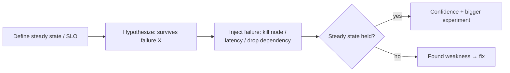

# Chaos Engineering

## Concept

- **Chaos engineering** is the practice of **deliberately injecting failures** into a system to discover weaknesses *before* they cause real outages — proactively verifying that your resilience mechanisms (failover, retries, circuit breakers, bulkheads, autoscaling) actually work under real conditions.
- It's the empirical complement to designing for failure: you *assume* the system is resilient, but chaos experiments *prove* it (or reveal it isn't). The method is scientific:
  1. Define **steady state** (a metric of healthy behavior, e.g., SLO-level success rate).
  2. Hypothesize that it holds under a specific failure.
  3. **Inject** the failure (kill a node, add latency, drop a dependency, exhaust resources).
  4. Measure; if steady state breaks, you found a real weakness to fix.
- Done with controlled **blast radius** (start small, in staging, then production), automated safety guardrails, and a tight feedback loop.

## Problem It Solves

- **Validates resilience for real** — resilience patterns (Phase 4: circuit breakers, bulkheads, failover, retries) are often untested until a real incident; chaos verifies they work *before* it matters. Untested failover famously fails when finally needed.
- **Surfaces hidden coupling & unknown failure modes** — distributed systems have emergent behaviors (cascading failures, retry storms, hidden hard dependencies) that only appear under failure; chaos reveals them in controlled conditions.
- **Builds confidence and incident-readiness** — teams practice failure (game days), improving both the system and the humans/runbooks that respond.

## Trade-offs

- **Production realism vs. risk** — chaos is most valuable in production (real traffic, real config) but riskiest there; mitigate with small blast radius, automated abort/rollback, off-peak timing, and progression from staging → limited prod → broader prod.
- **Prerequisite: observability & resilience basics** — injecting failure without good observability (topics 12–13) means you can't measure impact, and doing it on a system with no resilience just causes the outage you feared. Chaos comes *after* you've designed for failure, to verify it.
- **Organizational buy-in** — deliberately breaking production needs cultural acceptance and leadership support; "why are you causing outages?" is a real objection to manage.
- **Scope discipline** — uncontrolled experiments can cause real customer impact; guardrails (blast-radius limits, automatic abort on SLO breach) are mandatory.
- **Not a substitute** — chaos complements, not replaces, good design, testing, and monitoring.

## Examples

- **Instance/AZ termination**
  - Netflix's Chaos Monkey randomly kills production instances to ensure services tolerate instance loss; Chaos Kong simulates a whole-region failure to validate multi-region failover (topic 20).
- **Latency/dependency injection**
  - Inject 2s latency or errors into a downstream dependency to verify the caller's timeout + circuit breaker + fallback (Phase 3 topic 8) actually degrade gracefully instead of cascading.
- **Game day**
  - The team schedules an exercise: kill the primary database and verify automatic failover (Phase 3 topic 13), runbooks, and alerting all work — finding gaps in a controlled setting.
- **Resource exhaustion**
  - Fill a disk or spike CPU to confirm autoscaling (topic 24) and alerts respond and bulkheads (Phase 4 topic 29) contain the impact.
- **Interview framing**
  - When discussing reliability, propose chaos engineering to *verify* resilience patterns rather than assume them: define steady state, inject failures with controlled blast radius, and fix what breaks. Noting that it requires solid observability and resilience first, and careful blast-radius control in prod, shows you understand it as disciplined experimentation, not reckless breakage.
