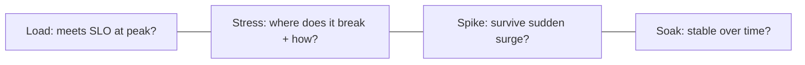

# Load & Stress Testing

## Concept

- **Performance testing** validates how a system behaves under load *before* real users find the limits. Several distinct test types answer different questions:
  - **Load testing** — does the system meet its SLOs at **expected** peak load? (e.g., 10k concurrent users.)
  - **Stress testing** — where does it **break**? Push past capacity to find the breaking point and observe *how* it fails (graceful degradation vs. collapse).
  - **Spike testing** — how does it handle a **sudden** surge (flash sale, viral event)? Tests autoscaling reaction time and backpressure.
  - **Soak (endurance) testing** — does it stay healthy under **sustained** load for hours/days? Reveals memory leaks, resource exhaustion, and slow degradation.
- The method: model **realistic traffic** (mix of endpoints, think-times, data variety), ramp load, and measure SLIs (latency percentiles, error rate, throughput, saturation) — ideally against a production-like environment.

## Problem It Solves

- Finds capacity limits, bottlenecks, and failure modes **proactively** — so you discover the database connection pool maxes out at 8k users in a test, not during your launch.
- **Validates capacity planning** (topic 26) and **autoscaling** (topic 24) — confirms the system actually scales and that scaling reacts fast enough.
- Reveals how the system **fails** — gracefully (sheds load, returns 429s, degrades) or catastrophically (cascading collapse, retry storms) — so you can fix the failure mode.
- Catches issues invisible at low load: connection exhaustion, lock contention, memory leaks (soak), GC pauses, downstream rate limits.

## Trade-offs

- **Realism vs. effort/cost** — meaningful results need production-like environments, data volumes, and realistic traffic models; testing against a tiny staging env or unrealistic uniform traffic gives misleading results. Realistic tests are expensive to build and run.
- **Test environment vs. production** — testing in prod is most realistic but risky (can cause real outages); a separate environment is safer but may not match prod's scale/config. Some teams do controlled prod load tests off-peak.
- **Synthetic vs. real traffic** — synthetic load may miss real-world patterns (cache behavior, data skew, third-party latency); shadowing/replaying real traffic is more accurate but harder.
- **Point-in-time vs. continuous** — a one-off load test goes stale as the system changes; ideally integrate performance tests into CI/CD to catch regressions (topic 5).
- **Coordinated-omission pitfall** — naive load tools under-report latency under overload; use tools that account for it.

## Examples

- **Pre-launch load test**
  - Before a product launch, ramp to 2× expected peak with realistic traffic mix and verify p99 latency and error rate stay within SLO — or find and fix the bottleneck (often the DB or a downstream dependency).
- **Stress to find the knee**
  - Push load until throughput plateaus and latency spikes; identify the limiting resource (CPU, connections, locks) and confirm the system sheds load gracefully (429s/backpressure) rather than collapsing.
- **Spike test for a sale**
  - Simulate a flash-sale surge to verify autoscaling (topic 24) scales out fast enough and backpressure (Phase 4 topic 8) protects the DB during the lag.
- **Soak test**
  - Run sustained load for 24h to catch a memory leak that only manifests after hours — invisible in short tests.
- **Tools**
  - k6, Gatling, Locust, JMeter generate load; observability (topics 12–13) measures the system's response.
- **Interview framing**
  - When capacity or scaling comes up, propose load/stress/spike/soak testing with realistic traffic against a production-like environment, measuring SLIs and *how* the system fails. Tying it to validating autoscaling and capacity planning, and integrating perf tests into CI to catch regressions, shows you verify scale empirically rather than hoping.
