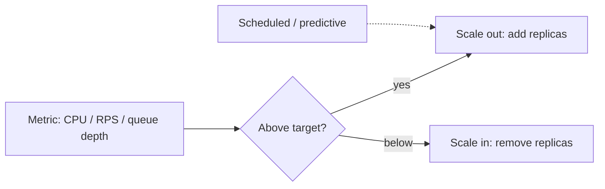

# Autoscaling Strategies

## Concept

- **Autoscaling** automatically adjusts capacity to match demand - adding resources under load and removing them when idle - so you maintain performance during spikes and save money during lulls.
- The dimensions of scaling:
  - **Horizontal (scale out/in)**: add/remove instances/pods/replicas. The dominant, near-unlimited approach for stateless services (Kubernetes HPA, cloud ASGs).
  - **Vertical (scale up/down)**: resize an instance (more CPU/RAM). Limited by max machine size; usually needs a restart. Good for stateful things that can't shard easily (Kubernetes VPA).
- The triggers:
  - **Reactive (metric-based)**: scale on observed load (CPU, memory, request rate, queue depth, p99 latency, or custom business metrics).
  - **Scheduled**: scale ahead of known patterns (business hours, daily peaks).
  - **Predictive**: use ML/forecasting to scale *before* anticipated demand, hiding scale-up lag.

## Problem It Solves

- **Handles variable demand cost-effectively**: instead of provisioning for peak 24/7 (wasteful) or fixed capacity (fails on spikes), capacity tracks load: pay for what you use, perform under spikes.
- **Resilience**: autoscaling also *replaces failed instances* (combined with health checks, topic 10), maintaining desired capacity automatically.
- Enables elasticity that makes cloud economically attractive vs. fixed hardware.

## Trade-offs

- **Scale-up lag vs. spike speed**: provisioning new instances/pods takes time (boot, warm-up, register); a sudden spike can outpace reactive scaling, causing a brief overload. Mitigate with headroom buffers, pre-warming, predictive/scheduled scaling, and backpressure (Phase 4 topic 8) to survive the lag.
- **Choosing the right metric**: CPU is the default but often wrong; the true bottleneck may be queue depth, latency, connections, or a downstream limit. Scaling on the wrong metric scales poorly. Custom/business metrics are often better.
- **Flapping/thrashing**: aggressive thresholds cause rapid scale-out/in oscillation; **cooldowns**, stabilization windows, and hysteresis prevent it.
- **Statefulness limits horizontal scaling**: stateless services scale freely; stateful ones need sharding or careful handling (sticky sessions break clean scaling - Phase 3 topic 5).
- **Downstream bottlenecks**: scaling the app tier can just shift overload onto the database (connection exhaustion - Phase 3 topic 15) or a downstream service; scale the *system*, not one tier in isolation.
- **Scale-to-zero trade-off**: saves max cost but reintroduces cold-start latency (serverless, topic 3).

## Examples

- **Kubernetes HPA**
  - An HPA scales pods 5→50 when CPU exceeds 70% (or on a custom metric like requests-per-second or queue length), with a stabilization window to avoid flapping.
- **Queue-depth scaling**
  - Worker count scales with the message-queue backlog (Phase 3 topic 19) rather than CPU - directly tracking the actual work to be done.
- **Scheduled + predictive**
  - Scale up before the daily 9am traffic ramp (scheduled) and use forecast-based predictive scaling ahead of a known marketing event, hiding the provisioning lag.
- **Spike protection**
  - During a flash sale, autoscaling ramps while backpressure/load-shedding and a queue absorb the surge until new capacity is ready.
- **Interview framing**
  - For variable load, propose horizontal autoscaling on the *right* metric (often queue depth or latency, not just CPU), with cooldowns to prevent flapping, headroom/predictive scaling for spike lag, and awareness that scaling one tier can overload downstream (DB connections). Pairing autoscaling with backpressure for the scale-up lag is the production-grade answer.
