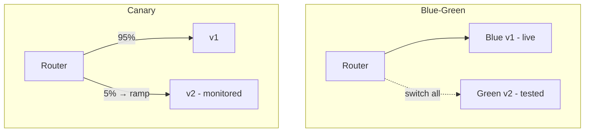

# Deployment Strategies: Blue-Green & Canary

## Concept

- **Deployment strategies** control *how* a new version replaces the old in production, trading risk, speed, cost, and rollback ability. (Distinct from feature flags, topic 6, which toggle features at runtime; these govern the *infrastructure rollout*.)
- The main strategies:
  - **Rolling** — replace instances in batches (new pods up, old drained). Default in Kubernetes; no extra infra, but old and new run simultaneously and rollback is slowish.
  - **Blue-Green** — run two full environments: **blue** (current) serves all traffic while **green** (new) is deployed and tested; then **switch all traffic** to green at once. Instant cutover and instant rollback (switch back to blue), but doubles infrastructure during the deploy.
  - **Canary** — route a **small percentage** of traffic to the new version, monitor its health (errors, latency, SLOs), and **gradually increase** if healthy (or roll back if not). Smallest blast radius; needs good metrics and traffic-splitting.
- These pair with monitoring (topics 12–13, 21) and often with automated rollback.

## Problem It Solves

- **Reduces deployment risk** — instead of a big-bang replace that exposes 100% of users to a bad release, these strategies limit blast radius and enable fast, often automatic, rollback.
- **Blue-green** gives near-instant cutover and rollback (flip the router) and lets you fully test the new environment before any user hits it.
- **Canary** catches problems with real production traffic at small scale before full exposure, and enables data-driven promotion based on actual health metrics.
- Together with CI/CD (topic 5) and SLOs (topic 21), they make frequent production deploys safe.

## Trade-offs

- **Blue-green: instant rollback vs. double cost** — running two full environments during the deploy doubles infrastructure cost; also tricky with **stateful** components and **database migrations** (both environments share/contend on the DB — needs backward-compatible migrations, Phase 3 topic 12).
- **Canary: safest vs. complexity** — smallest blast radius and great signal, but requires traffic-splitting infrastructure (load balancer/mesh/ingress), solid per-version metrics, and enough traffic for the canary to be statistically meaningful; low-traffic services get weak canary signal.
- **Rolling: simple/cheap vs. mixed versions & slow rollback** — no extra infra, but old and new run together (needs compatibility) and rolling back means rolling forward again, which is slower.
- **Database compatibility is the common hard part** — all strategies require new and old code to work against the *same* database during the transition (expand-contract migrations); a breaking schema change defeats easy rollback.
- **Automation maturity** — canary's value is fullest with automated analysis + rollback (Flagger, Argo Rollouts, Spinnaker); manual canary watching doesn't scale.

## Examples

- **Canary with automated analysis**
  - Argo Rollouts/Flagger shifts 5% of traffic to v2, queries Prometheus for error rate and latency vs. v1, and auto-promotes in steps (5→25→50→100%) or auto-rolls-back on SLO breach.
- **Blue-green cutover**
  - Green is deployed and smoke-tested with no user traffic; the load balancer switches 100% to green; if errors spike, flip back to blue instantly — rollback in seconds.
- **Backward-compatible migration**
  - Before a blue-green deploy, the schema is changed via expand-contract (Phase 3 topic 12) so both blue and green work against it during the switch.
- **Strategy by risk**
  - Low-risk change → rolling; high-risk change with good metrics → canary; change needing instant rollback and a clean test → blue-green.
- **Interview framing**
  - When asked how you'd deploy safely, name the strategy and justify it: rolling (simple default), canary (smallest blast radius, needs metrics + traffic-splitting + automated rollback), blue-green (instant cutover/rollback, double cost). Always raise **database backward-compatibility** as the constraint that makes or breaks safe rollback — that's the detail that signals real deployment experience.
