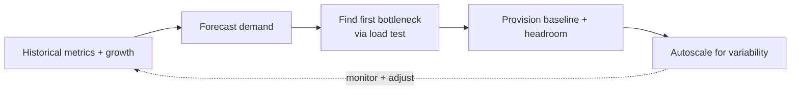

# Capacity Planning

## Concept

- **Capacity planning** is determining how much infrastructure (compute, memory, storage, network, database throughput) a system needs to meet demand at acceptable performance and cost — both **now** and as it **grows** — so you neither run out of capacity (outages) nor massively over-provision (waste).
- It extends the back-of-envelope estimation from Phase 0 (topic 3) into an ongoing *production operations* discipline:
  - **Demand forecasting** — project traffic/storage growth from historical trends, seasonality, and planned events (launches, marketing).
  - **Headroom** — provision above current peak (commonly target ~50–70% peak utilization) so you have buffer for spikes and for the time it takes to add capacity.
  - **Bottleneck identification** — find the resource that saturates *first* (often DB throughput, connections, or memory — not CPU) via load testing (topic 23) and observability (topics 12–13).
  - **Scaling headroom + autoscaling** — combine baseline capacity for the predictable load with autoscaling (topic 24) for variability.

## Problem It Solves

- Prevents **capacity-driven outages** — running out of database connections, disk, memory, or throughput during a peak — by planning ahead with headroom and knowing the breaking point.
- Prevents **cost waste** from over-provisioning "to be safe" — right-sizing baseline + autoscaling instead of permanent peak capacity (ties to cost optimization, topic 19).
- Informs **architecture decisions** — capacity numbers reveal when you must shard (Phase 3 topic 14), add caching, or re-architect because a component can't scale further.
- Supports SLOs (topic 21) by ensuring there's enough capacity to meet latency/availability targets under forecast load.

## Trade-offs

- **Headroom vs. cost** — more buffer means safer spikes but higher idle cost; the right headroom depends on traffic volatility and how fast you can add capacity (autoscaling lag, topic 24). Too little headroom and a spike causes an outage; too much wastes money.
- **Forecast uncertainty** — demand is hard to predict (viral events, unexpected growth); plans must include margin and the ability to scale fast, not just a point estimate.
- **The bottleneck is often not CPU** — naive planning sizes CPU; the real limit is frequently DB write throughput, connection pools (Phase 3 topic 15), memory, or a downstream third-party limit. Load testing reveals the true constraint.
- **Reactive autoscaling isn't a complete substitute** — autoscaling handles variability but has lag and limits (downstream bottlenecks, stateful tiers); you still need baseline capacity planning for the floor and for things that don't autoscale (databases).
- **Continuous, not one-time** — capacity needs change as the system and traffic evolve; plans must be revisited regularly.

## Examples

- **Growth-based provisioning**
  - Storage grows 10%/month; the team forecasts 18 months out, plans sharding before the single-node limit (Phase 3 topic 14), and provisions DB IOPS with headroom for projected peak.
- **Headroom target**
  - Services run at ~60% peak CPU/connection utilization so a 1.5× spike is absorbed while autoscaling adds capacity, avoiding overload during the scale-up lag.
- **Event capacity**
  - Ahead of a Black Friday sale, capacity is planned and load-tested (topic 23) for 5× normal peak, with scheduled pre-scaling (topic 24) so capacity is ready before the surge.
- **Bottleneck discovery**
  - Load testing shows the database connection pool — not app CPU — saturates first at 8k concurrent users; the plan adds a connection pooler and read replicas rather than more app servers.
- **Interview framing**
  - When scale or growth comes up, go beyond Phase 0 estimation: forecast demand, provision baseline + headroom, identify the *true* first bottleneck via load testing (often DB/connections, not CPU), and layer autoscaling for variability. Treating capacity as continuous, bottleneck-driven, and tied to SLOs/cost shows production operations maturity.
