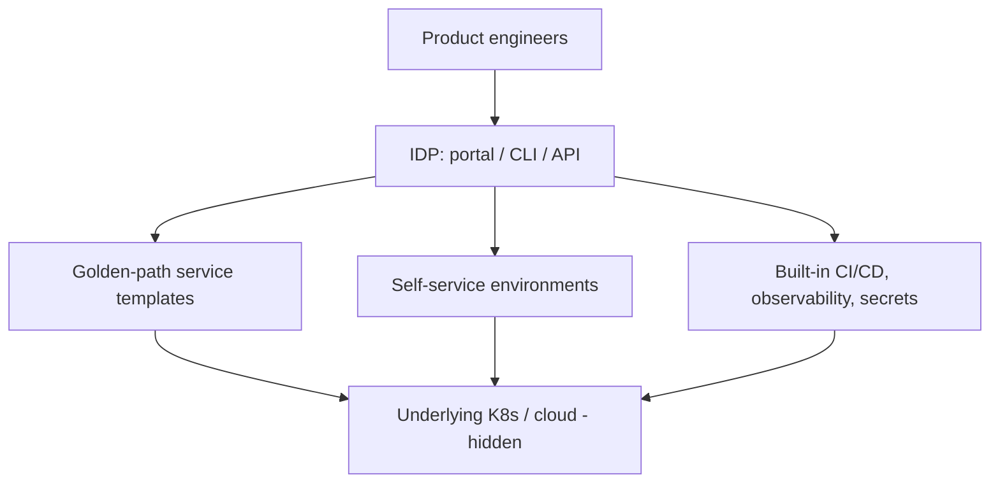

# Platform Engineering & Internal Developer Platforms

## Concept

- **Platform engineering** builds an **Internal Developer Platform (IDP)** — a curated layer of self-service tooling, automation, and "golden paths" that lets product engineers build, ship, and run services **without** becoming experts in Kubernetes, cloud, CI/CD, and networking. It productizes infrastructure for internal developers.
- It emerged as a response to the cognitive overload of "you build it, you run it" DevOps at scale: every team independently wiring up pipelines, clusters, observability, and security is wasteful and inconsistent. Platform engineering centralizes that into a **paved road**.
- Core ideas:
  - **Self-service** — developers provision environments, deploy, and get observability/secrets via a portal or CLI/API, without filing tickets to an ops team.
  - **Golden paths / paved roads** — opinionated, supported defaults for the common case (a standard service template with CI/CD, monitoring, and security built in) that make the right way the easy way.
  - **Abstraction with escape hatches** — hide infrastructure complexity, but allow advanced teams to go off-road when needed.
  - **Platform as a product** — the platform team treats internal developers as customers, with a roadmap, UX, and feedback loops.

## Problem It Solves

- **Reduces developer cognitive load** — engineers focus on product code instead of mastering Kubernetes, Terraform, networking, and security plumbing; the platform handles the undifferentiated heavy lifting.
- **Consistency & standards at scale** — golden paths bake in best practices (security, observability, deployment safety) so every service gets them by default, rather than each team reinventing (and getting them wrong).
- **Velocity** — self-service removes ops-ticket bottlenecks; spinning up a production-ready service goes from weeks to minutes.
- **Leverage** — a small platform team multiplies the productivity of many product teams (the core Staff+/org-scaling argument, Phase 11).

## Trade-offs

- **Standardization vs. flexibility** — opinionated paved roads speed the common case but can frustrate teams with unusual needs; without escape hatches, the platform becomes a straitjacket teams route around. Balance is the central tension.
- **Platform as product requires investment** — a half-built, unmaintained IDP becomes shelfware that teams bypass; it needs real funding, product thinking, and ongoing maintenance, or it adds a layer without the value.
- **Abstraction leakage** — when the abstraction breaks, developers must suddenly understand the hidden complexity anyway; good platforms make the underlying layer inspectable, not a black box.
- **Premature platforming** — building an elaborate IDP for a handful of teams is over-engineering; platform engineering pays off at organizational scale (many teams), not for a small startup.
- **Centralization risk** — the platform becomes a critical dependency and potential bottleneck if under-resourced.

## Examples

- **Golden-path template**
  - A developer runs `create-service`, which scaffolds a repo with CI/CD, a Dockerfile, Kubernetes manifests, observability wired up (topics 12–13), secrets integration, and a deployment pipeline — production-ready in minutes, all best-practice by default.
- **Self-service portal (Backstage)**
  - Spotify's Backstage provides a developer portal cataloging services, templates, docs, and self-service actions — a common IDP foundation.
- **Abstraction over Kubernetes**
  - Developers describe their service in a simple spec; the platform translates it into the underlying K8s manifests, ingress, autoscaling, and monitoring — hiding the YAML.
- **Escape hatch**
  - An advanced team needing a custom networking setup drops below the abstraction to raw Terraform, while still using the platform's CI/CD and observability.
- **Interview framing**
  - For scaling engineering productivity across many teams, propose platform engineering: an IDP with self-service and golden paths that bake in security/observability/deployment, reducing cognitive load while keeping escape hatches. Stressing "platform as a product" (needs investment) and the standardization-vs-flexibility balance — and that it's for org scale, not small teams — connects infrastructure to the Staff+ org-leverage theme.
