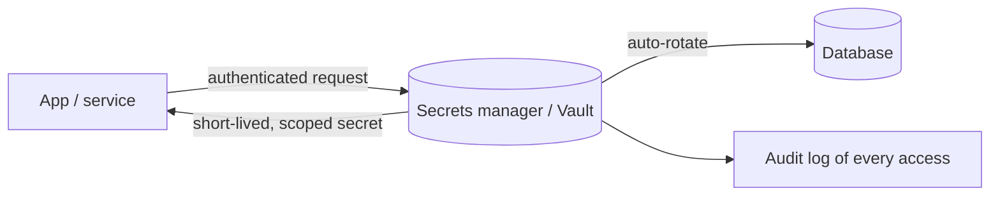

# Secrets Management

## Concept

- **Secrets management** is the secure handling of sensitive credentials - database passwords, API keys, TLS private keys, tokens, encryption keys - across their full lifecycle: storage, distribution to applications, rotation, and revocation.
- The anti-pattern it replaces: secrets hardcoded in source code, committed to Git, baked into Docker images, or sitting in plaintext config/env files - all of which leak constantly (exposed repos, image layers, logs).
- A secrets manager provides:
  - **Centralized, encrypted storage**: secrets encrypted at rest, access-controlled and audited (Vault, AWS Secrets Manager, GCP Secret Manager, Azure Key Vault).
  - **Dynamic secrets**: generate short-lived credentials on demand (e.g., a database credential valid for 1 hour), so there's no long-lived secret to steal.
  - **Automatic rotation**: rotate secrets on a schedule without app downtime.
  - **Least-privilege access**: each service can read only the secrets it needs, with every access audited.
  - **Encryption-as-a-service / KMS**: manage the encryption keys that protect data at rest.

## Problem It Solves

- **Stops secret leakage**: removes credentials from code, images, and config, where they're routinely exposed; secrets live in one encrypted, access-controlled, audited place.
- **Limits breach impact**: dynamic, short-lived, least-privilege secrets mean a stolen credential is narrowly scoped and expires fast, drastically reducing blast radius.
- **Enables rotation**: automatic rotation (and the ability to revoke instantly) contains compromise; long-lived static secrets that never rotate are a top breach vector.
- **Auditability & compliance**: every secret access is logged, satisfying security and compliance requirements.

## Trade-offs

- **Security vs. complexity & availability**: a secrets manager is critical infrastructure: if it's down, apps can't get credentials and may fail to start. It must be highly available, and apps need caching/graceful handling of brief unavailability - adding operational complexity.
- **Dynamic secrets vs. integration effort**: short-lived dynamic credentials are far safer but require apps/databases to support on-demand credential issuance and renewal; static secrets are simpler but riskier.
- **Rotation vs. coordination**: rotating a secret must not break running apps mid-flight; needs grace periods / dual-validity windows (the old and new secret both valid briefly), similar to expand-contract (Phase 3 topic 12).
- **Bootstrapping problem**: the app needs *some* credential to authenticate to the secrets manager itself (the "secret zero" problem); solved via platform identity (Kubernetes service accounts, cloud IAM roles, instance identity) rather than another stored secret.
- **Sprawl & access governance**: many secrets across many services need clear ownership, least-privilege policies, and lifecycle management, or the manager becomes an unaudited dumping ground.

## Examples

- **Dynamic database credentials**
  - An app authenticates to Vault using its Kubernetes service-account identity (no stored secret), and Vault issues a database credential valid for 1 hour - no long-lived DB password exists to leak.
- **Automatic rotation**
  - AWS Secrets Manager rotates an RDS password every 30 days via a rotation function, with both old and new valid during the cutover so running apps don't break.
- **Secret zero via cloud identity**
  - An EC2 instance/pod uses its IAM role / service-account token to authenticate to the secrets manager - the platform provides identity, so no bootstrap secret is stored.
- **Pipeline secrets**
  - CI/CD pulls deploy credentials from the secrets manager at runtime (scoped, short-lived, audited) instead of storing them in pipeline config (ties to supply-chain security).
- **Interview framing**
  - Whenever credentials/keys appear in a design, state that secrets live in a secrets manager (Vault/cloud KMS) - never in code, images, or env files - with least-privilege access, automatic rotation, and ideally **dynamic short-lived credentials**. Mentioning the secret-zero problem (solved by platform/cloud identity) and rotation grace windows shows real security operations depth.
