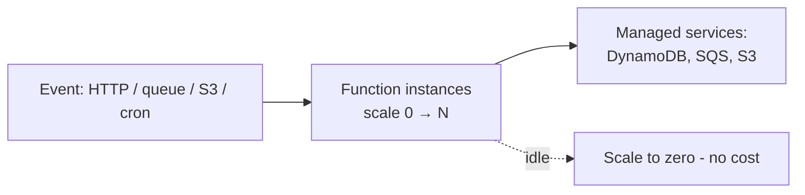

# Serverless Architecture

## Concept

- **Serverless** lets you run code without managing servers: you deploy **functions** (FaaS — AWS Lambda, Cloud Functions) or use fully-managed **backend services** (databases, queues, auth), and the cloud provider handles provisioning, scaling, patching, and availability. You pay **per execution/usage**, not for idle capacity.
- Defining properties:
  - **Event-driven** — functions run in response to events (HTTP request, queue message, file upload, schedule).
  - **Auto-scaling to demand** — scales from zero to thousands of concurrent executions automatically, including **scale-to-zero** (no cost when idle).
  - **Stateless & ephemeral** — each invocation is short-lived and stateless; state lives in external managed services.
  - **Fine-grained billing** — pay for actual compute time (ms) and invocations.
- "Serverless" doesn't mean no servers — it means *you* don't manage them.

## Problem It Solves

- **No infrastructure management** — no servers to provision, patch, or scale; the team focuses on code, not ops.
- **Cost efficiency for variable/spiky/low traffic** — scale-to-zero and per-use billing mean you pay nothing when idle and scale instantly for bursts — ideal for unpredictable or low-volume workloads.
- **Elastic scale** — handles sudden spikes automatically without capacity planning.
- **Fast time-to-market** — glue managed services together with small functions.

## Trade-offs

- **Cold starts** — a function that hasn't run recently incurs startup latency (loading the runtime/code), problematic for latency-sensitive paths; mitigations (provisioned concurrency, lighter runtimes) add cost/complexity.
- **Statelessness & external state** — no in-memory state across invocations; everything goes to external stores, and the **connection problem** (many short-lived functions exhausting DB connections) needs a pooler/proxy (Phase 3 topic 15).
- **Execution limits** — max duration, memory, and payload caps make serverless unsuitable for long-running or heavy compute jobs.
- **Cost at high steady load** — per-invocation pricing is cheap when idle/spiky but can be *more* expensive than always-on servers at sustained high volume; model the crossover.
- **Vendor lock-in & local dev/testing** — deep coupling to a provider's event model and services; harder to run/test locally and to port.
- **Observability** — distributed, ephemeral functions are harder to trace/debug (needs good tracing, topic 12).

## Examples

- **Event-driven processing**
  - An image uploaded to S3 triggers a Lambda that generates thumbnails and writes them back — no server, scales with upload volume, costs nothing when idle.
- **Serverless API**
  - API Gateway → Lambda → DynamoDB, with RDS Proxy if a relational DB is used, gives a fully-managed, auto-scaling backend.
- **Scheduled jobs**
  - A cron-triggered function runs a nightly cleanup (ties to distributed scheduling, Phase 4 topic 28).
- **When not to use**
  - A high-throughput, latency-critical, always-busy service may be cheaper and faster on containers/K8s; long-running ML training won't fit function limits.
- **Interview framing**
  - Propose serverless for event-driven, spiky, or low/variable-traffic workloads where scale-to-zero and zero ops shine — and call out cold starts, the DB-connection problem, execution limits, and the high-steady-load cost crossover. Knowing when serverless is *wrong* (sustained high load, long jobs, latency-critical) is the senior signal.
