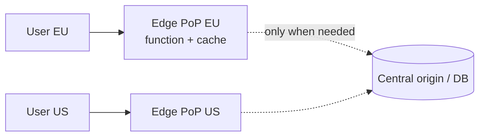

# Edge Computing

## Concept

- **Edge computing** runs computation **geographically close to users** - at CDN points of presence (PoPs) distributed worldwide - instead of (only) in a few centralized data centers/regions. It pushes logic to the network edge to cut latency.
- It extends the CDN (Phase 2, topic 5) from caching *static* assets to running *dynamic* code at the edge:
  - **Edge functions / workers** (Cloudflare Workers, Lambda@Edge, Vercel Edge) - lightweight code executing at the PoP nearest the user, with tiny cold starts (often V8 isolates, not containers).
  - **Edge rendering**: generating/personalizing HTML at the edge (SSR/ISR close to the user, Phase 5 topic 3).
  - **Edge data**: replicated/eventually-consistent data stores at the edge (Cloudflare KV/D1, edge caches) for low-latency reads.
- The trade space: the edge is fast and globally distributed but **resource-constrained** and **far from your primary database**.

## Problem It Solves

- **Latency**: running logic at a PoP a few ms from the user beats a round trip to a distant region (which can be 100-300ms intercontinentally). Critical for global UX.
- **Offload & resilience**: handle requests at the edge (auth checks, A/B routing, personalization, caching) without hitting the origin, reducing origin load and improving availability.
- **Personalization without losing cache**: modify cached responses at the edge per user/geo (e.g., localization, feature flags) without re-rendering centrally.
- Brings compute to globally-distributed users at scale, which centralized architectures can't match on latency.

## Trade-offs

- **Proximity vs. constrained environment**: edge runtimes have strict limits (CPU time, memory, no full Node APIs, limited libraries) and short execution budgets; heavy or stateful work doesn't fit.
- **Distance from primary data**: the edge is close to users but **far from your central database**; reads needing the origin DB lose the latency benefit. You need edge-replicated data, caching, or eventual-consistency designs - and writes typically still go to the origin.
- **Consistency**: edge data stores are eventually consistent/geo-replicated; strong consistency at the edge is hard (CAP/PACELC, Phase 4).
- **Debugging & observability**: distributed across hundreds of PoPs, harder to trace and reason about.
- **Vendor-specific**: edge platforms have proprietary runtimes/APIs and data stores; portability is limited.

## Examples

- **Edge auth / routing**
  - An edge function validates a JWT, does geo-based routing or A/B assignment, and adds headers at the PoP - rejecting bad requests before they ever reach the origin.
- **Edge personalization on cached content**
  - A globally-cached page is lightly rewritten at the edge per user (locale, logged-in name, flags), keeping CDN cache benefits while personalizing.
- **Edge rendering**
  - SSR/ISR executed at the edge renders pages near the user for fast TTFB worldwide (Phase 5 topic 3).
- **Edge KV for reads**
  - Feature flags or config stored in an edge KV store give sub-ms reads globally, updated from a central source.
- **Interview framing**
  - Propose edge computing to cut latency for a global audience (auth, routing, personalization, caching, edge rendering) - while being explicit that the edge is constrained and **far from the primary DB**, so writes and strongly-consistent reads stay central and edge data is eventually consistent. That data-locality nuance is the key insight.
