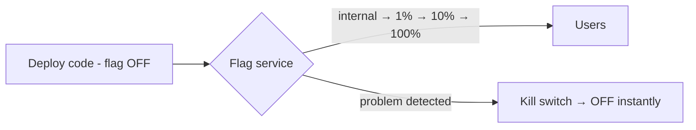

# Feature Flags and Progressive Delivery

## Concept

- A **feature flag** (feature toggle) is a runtime switch that turns functionality on/off **without deploying code**. It decouples **deployment** (shipping code to production) from **release** (exposing a feature to users) — a foundational practice for safe, fast delivery.
- **Progressive delivery** builds on flags to roll features out **gradually and observably**: release to internal users → 1% → 10% → 100%, watching metrics at each step, and instantly turning it off if something breaks.
- Flag types:
  - **Release flags** — gate new features for gradual rollout.
  - **Ops/kill switches** — disable a feature or degrade gracefully under load/incident.
  - **Experiment flags** — A/B tests (split traffic, measure outcomes).
  - **Permission flags** — entitlements per user/plan.
- Flags are evaluated at runtime per user/segment via a flag service (LaunchDarkly, Unleash, Flagsmith, or homegrown).

## Problem It Solves

- **Decouples deploy from release** — code can be merged and deployed (even "dark") while hidden behind a flag, then released gradually on its own schedule — enabling trunk-based development and continuous deployment without exposing unfinished work.
- **De-risks releases** — gradual rollout limits blast radius; a kill switch turns off a bad feature in seconds without a redeploy/rollback.
- **Experimentation** — measure a feature's impact on real users before committing (A/B tests).
- **Operational control** — shed load or disable expensive features during incidents.

## Trade-offs

- **Flexibility vs. flag debt** — flags accumulate; stale flags become dead code and a combinatorial-testing nightmare. **Flags need lifecycle management** — remove them once a feature is fully rolled out.
- **Testing complexity** — every flag doubles possible states; many flags create exponential combinations that can't all be tested. Keep flags few and short-lived.
- **Runtime dependency** — the flag service is in the request path (or cached); its latency/availability matters, and a misconfigured flag can cause an incident. Cache flag values and fail safe to sane defaults.
- **Consistency** — a user should see consistent flag state across requests/sessions (sticky bucketing), or the UX is confusing.
- **Security/visibility** — flags controlling sensitive behavior need auditing and access control.

## Examples

- **Dark launch + gradual rollout**
  - A new checkout flow is deployed behind a flag (off), enabled for internal staff, then 1%/10%/50%/100% of users while watching error rates and conversion (RUM/SLOs) — rolled back instantly via the flag if metrics dip.
- **Kill switch**
  - A recommendations feature is causing latency spikes; ops flips its flag off to degrade gracefully (Phase 5 topic 21) without a deploy.
- **A/B experiment**
  - 50/50 split between two designs; the flag service assigns sticky buckets and the experiment platform measures the outcome (ties to AI A/B testing, Phase 7).
- **Flag cleanup**
  - After full rollout, the flag and its dead branch are removed in the next sprint to avoid flag debt.
- **Interview framing**
  - Use feature flags to decouple deploy from release and enable progressive delivery (gradual rollout + kill switch) with monitoring at each step. Proactively raising **flag debt / lifecycle management** and failing safe on the flag service shows you've operated flags, not just used them. (Distinct mechanisms — blue-green and canary — are covered in topic 25.)
