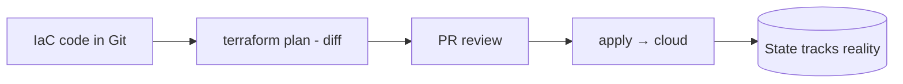

# Infrastructure as Code

## Concept

- **Infrastructure as Code (IaC)** manages infrastructure — servers, networks, databases, load balancers, DNS, IAM — through **declarative, version-controlled code** instead of manual console clicks. You describe the *desired state* and a tool makes reality match it.
- Two styles:
  - **Declarative** (Terraform, CloudFormation, Pulumi) — you specify the end state; the tool computes the diff and applies changes. Dominant approach.
  - **Imperative** (scripts) — you specify the steps. More brittle.
- Core practices:
  - **State management** — the tool tracks current infrastructure state to compute changes (Terraform state file).
  - **Plan/apply** — preview the diff (`plan`) before applying it, so changes are reviewable.
  - **Idempotency** — re-running converges to the same state, not duplicating resources.
  - **Modules** — reusable, parameterized infrastructure components.
- Often paired with **GitOps**: infrastructure changes are PRs, reviewed and applied via CI/CD.

## Problem It Solves

- **Reproducibility** — spin up identical environments (dev/staging/prod, or a new region) from the same code, eliminating snowflake servers and "it works in prod only" mysteries.
- **Versioned, auditable, reviewable infra** — changes go through Git with history, code review, and rollback — instead of undocumented console clicks no one can trace.
- **Disaster recovery & scale** — rebuild infrastructure from code after a disaster (topic 11) or replicate to a new region quickly (topic 20).
- **Consistency & automation** — removes manual error and enables CI/CD for infrastructure.

## Trade-offs

- **State management is the hard part** — the state file is critical and sensitive (it can contain secrets); it must be stored remotely, locked (to prevent concurrent applies), and backed up. Corrupted/diverged state causes painful drift.
- **Drift** — manual changes outside IaC make reality diverge from code; enforce "no console changes" and detect drift, or IaC's guarantees erode.
- **Blast radius** — a bad `apply` can destroy/recreate production resources; `plan` review, targeted applies, and `prevent_destroy` guards are essential.
- **Learning curve & abstraction leaks** — IaC tools have their own languages/quirks; complex modules can be hard to reason about.
- **Declarative limits** — some operations (ordering, one-off migrations) are awkward declaratively and need escape hatches.

## Examples

- **Multi-environment from modules**
  - A Terraform module defines a service's infra (LB, ASG, DB); dev/staging/prod instantiate it with different parameters — identical shape, different sizing.
- **Plan-review-apply in CI**
  - A PR changes infra code; CI runs `terraform plan` and posts the diff for review; on merge, CI applies it — infra changes are auditable PRs.
- **Disaster recovery**
  - After a region failure, the same IaC provisions the full stack in another region (topic 11/20).
- **Remote locked state**
  - State stored in S3 with DynamoDB locking prevents two engineers from applying conflicting changes simultaneously.
- **Interview framing**
  - For provisioning/managing infrastructure, propose IaC (Terraform/Pulumi) with version control, plan/apply review, modules, and remote locked state — enabling reproducible environments, DR, and auditable changes. Calling out state management and drift as the hard parts shows real operational experience.
